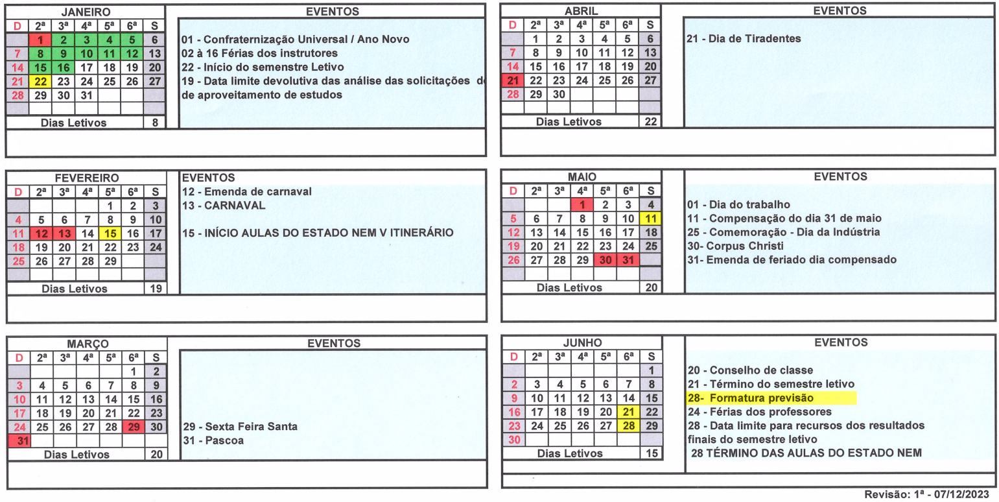
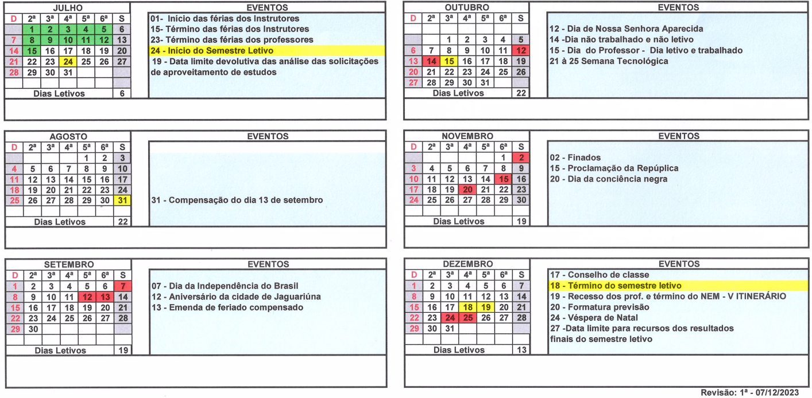

# Repositório com materiais de aulas (códigos, exercícios, desafios, atividades)
## Cursos onde ministro aulas
- [Técnico em Desenvolvimento de Sistemas (1200 horas)](./ds/README.md)
- Operador de Microcomputador (160 horas)
- Web designer – Front-End (180 horas)
- Implantação e Análise de Dados em Núvem - Microsoft DP900 (40 Horas)
- Implantação de serviços de Inteligêcia Artificical em Núvem - Microsoft AI900 (40 Horas)
- Implantação de serviços em Núvem - Google Cloud Foundations (40 Horas)
- Implantação de serviços de Inteligêcia Artificical em Núvem - Google Cloud AI oundations (40 Horas)
- Excel Básico (40 Horas)
- Excel Avaçado + VBA (40 Horas)
- Power BI (20 Horas)
## OBS
Os códigos fonte, exemplos e materiais didáticos serão adicionados a este repositório ao longo do ano de 2024, consulte também os repositórios senai2023, senai2022 e senai2021 pois estão repletos de materiais dos anos passados.

## Biblioteca SENAI
- [Conecta SENAI](https://www.conectasenai.com.br/login/)
- [Passo a passo para acessar o conecta SENAI](./conecta-passo-a-passo.pdf)

## Calendário

## Competências transversais
- Acessar o portal EAD https://ead.sp.senai.br
- Tutorial de como acessar o Portal EAD a primeira vez https://ead.sp.senai.br/tutorial/comoacessar/
- Verificar se está matriculado em algum curso e completar todos os que estiver matriculado
- Caso já tenha concluído os cursos escolha mais algum dos cursos sugeridos no site do senai:
https://jaguariuna.sp.senai.br/cursos/13/899/formacao-inicial-e-continuada?Parent=898
    - Excel Básico
    - Lógica de Programação
    - Desvendando a Indústria 4.0
    - Desvendando a BlockChain
    - Economia circular
- Enviar os arquivos dos certificados (imagem ou PDF) em: https://forms.gle/STMxikkU8qVfLuEb8

## Banco de talentos
- Se você é:
    - aluno do SENAI em faze final de formação
    - aluno de graduação ou já se formou em qualquer instituição de ensino.
    - possui conhecimentos ou habilidades e deseja trabalhar no SENAI.
- [Banco de Talentos](https://sesisenaisp.jobs.recrut.ai/)
- [Banco de Talentos PCD](https://sesisenaisp.jobs.recrut.ai/job/LKJV4W)

## GitHub dos outros professores do SENAI Jaguariúna
- [Reenye](https://github.com/ReenyeLima)
- [Lucas Paiva](https://github.com/lucasPaiva00)
- [Matheus Pignata](https://github.com/MatheusPignata)
- [Renato](https://github.com/remajag)