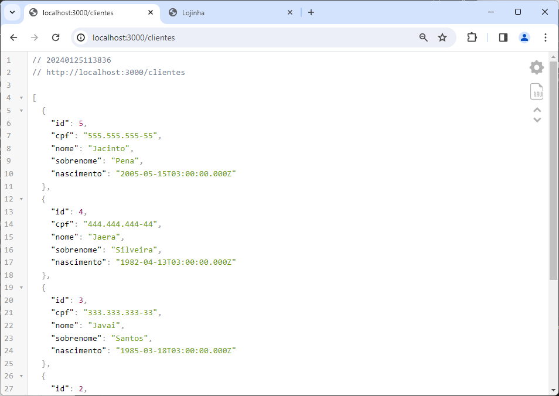
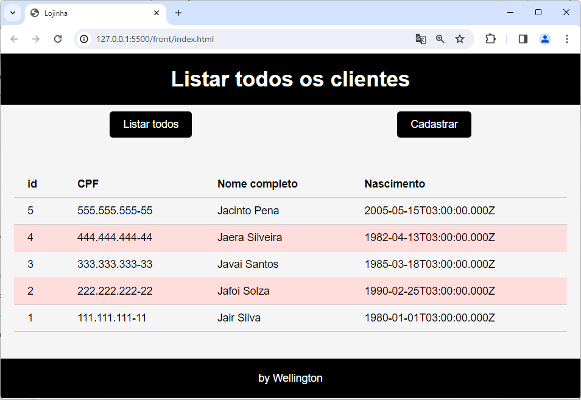
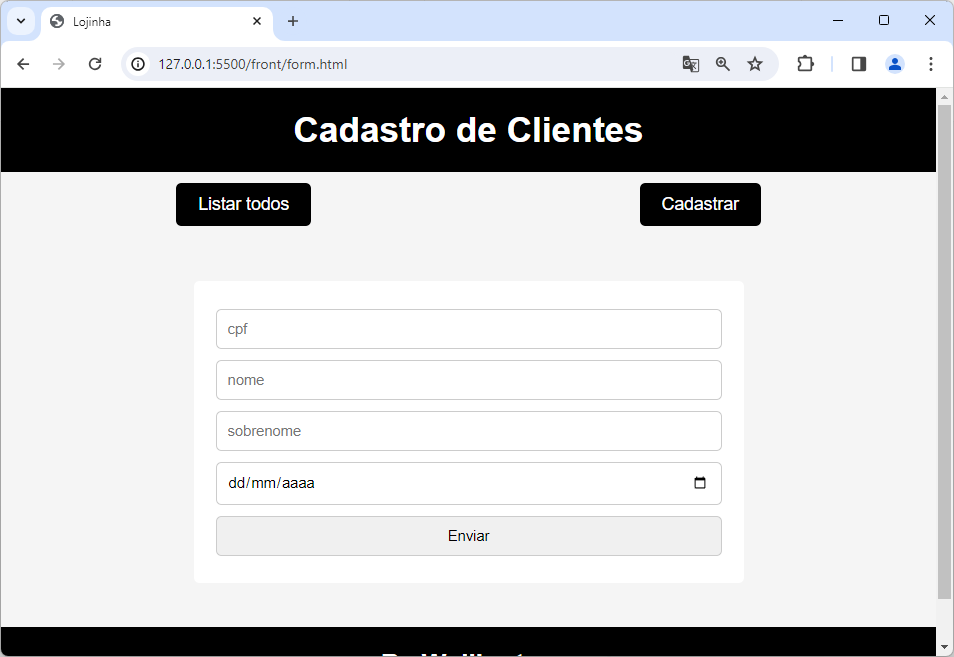
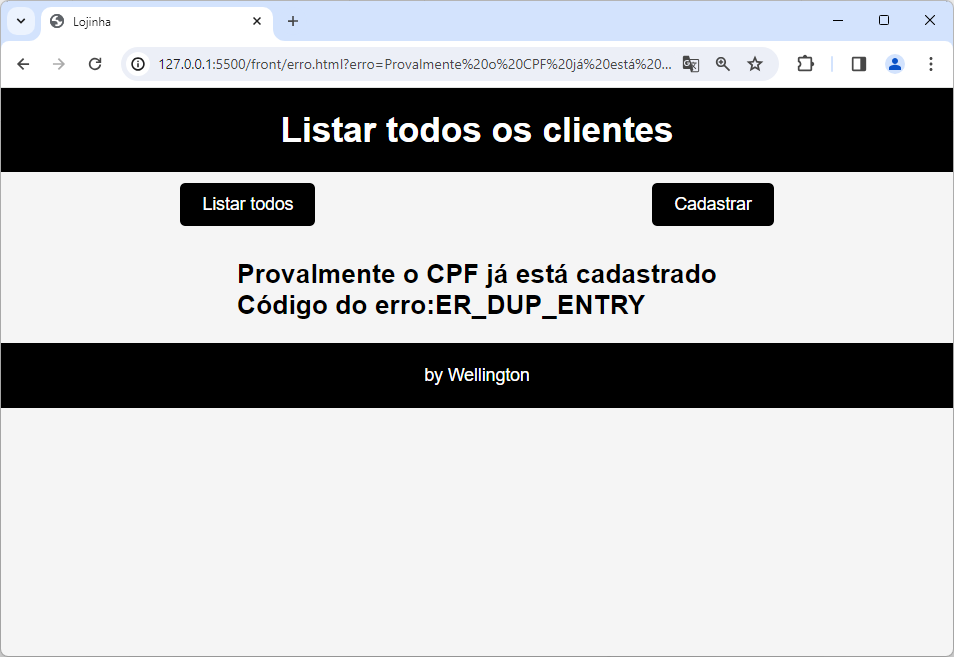

# Aula02

## Vernos HTTP (POST e GET)
Trabalhando com o projeto **Lojinha** utilizaremos os verbos corretos **GET** para listar todos e **POST** para criar, para isso precisaremos da biblioteca body-parser.

## Conhecimentos NodeJS
- Biblioteca body-parser
- Redirecionamento de Páginas
- Envio de mensagens de erro via URL query

## Projeto Loginha Full Stack com cadastro de clientes básico (GET, POST)

- Concluímos as telas front-end (index.html, form.html, erro.html)

## Projeto Lojinha
O projeto está neste repositório na pasta ./lojinha com as instruções para testar em ./lojinha/README.md

## Atividade 01 - EAD
Utilizando como modelo o projeto **Lojinha**, em duplas, escolha um dos temas a seguir e desenvolva um projeto full-stack.
- Patrimônio/Inventário
- Produtos da cantina
- Livros em uma Biblioteca
- Produtos em uma papelaria
- Cadastro de Filmes preferidos
- Cadastro de Músicas preferidas
- Outro conforme sua criatividade, desde que envolva apena uma tabela em um banco dedados.

### Entrega:
- 01/02/2024 em um repositório público do github
- O link do forms para a entrega estará aqui:

