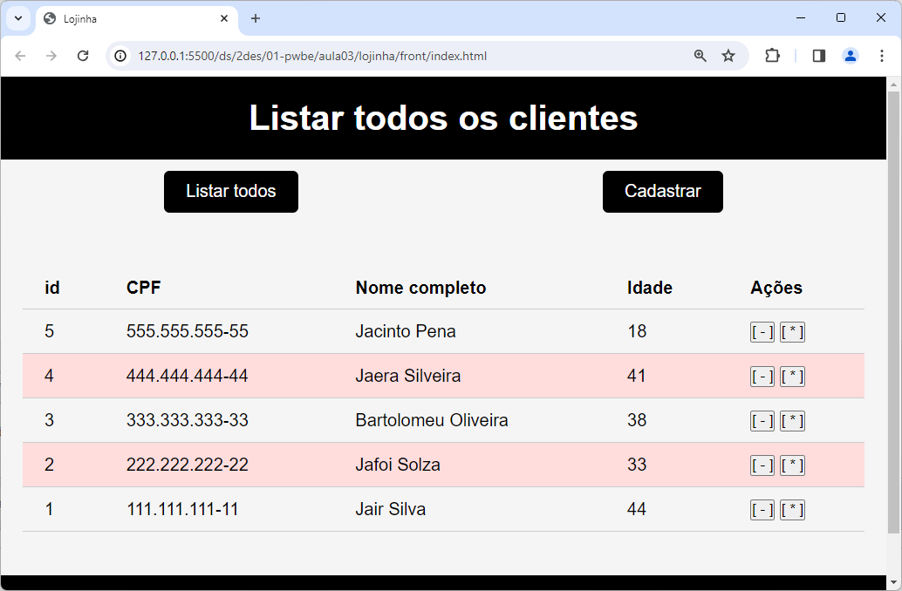

# Aula02

## Verbos HTTP (PUT e DELETE)
Trabalhando com o projeto **Lojinha** utilizaremos os verbos corretos **DELETE** para excluir e **PUT** para atualizar.

## Conhecimentos NodeJS
- Biblioteca body-parser
- Redirecionamento de Páginas
- Envio de mensagens de erro via URL query
- documento JSON
- Aplicativo Insomnia para testes

## Projeto Loginha Full Stack com cadastro de clientes básico (GET, POST)
- Concluímos as telas front-end (index.html, form.html, erro.html)

## Projeto Lojinha
O projeto está neste repositório na pasta ./lojinha com as instruções para testar em ./lojinha/README.md

## Atividade

### Contextualização:

Utilizando como modelo o projeto desta pasta ./lojinha, conforme demonstração em sala de aula sobre as funções UPDATE e DELETE, implemente estas **feactures** (funcionalidades) no seu projeto

### Entregas:
Apresente seu projeto em funcionamento local para seu instrutor