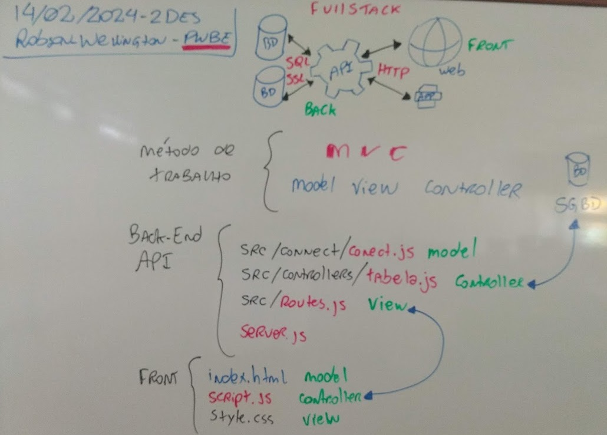
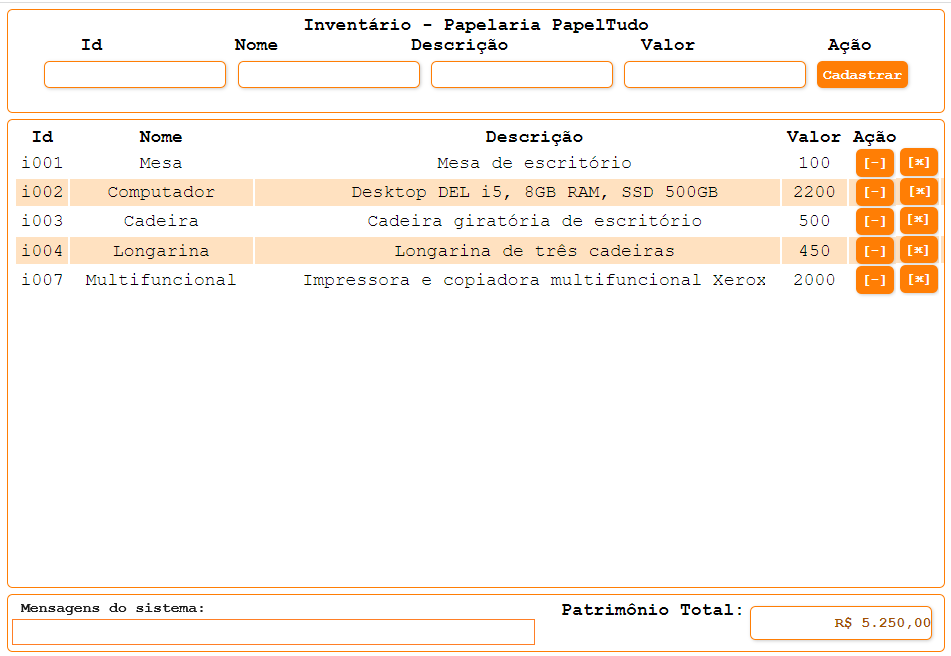
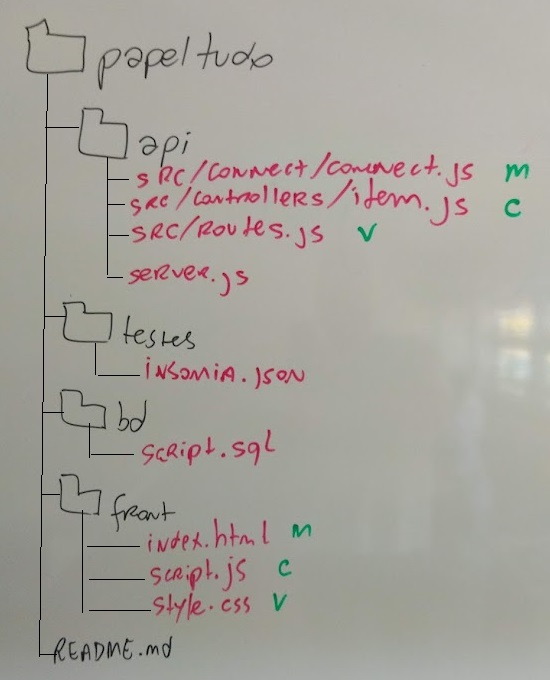

# Aula04 - MVC

## Conhecimentos:
- 1 Ambiente de desenvolvimento web
- 2 Padrão de desenvolvimento MVC
    - 2.1 Definição
    - 2.2 Aplicabilidade

## Lousa


## Atividade - Individual
|Contextualização|
|-|
|A papelaria PapelTudo necessita de um sistema para registrar todo o seu inventário, você como programador full-stack foi contratado para criar esta primeira parte do sistema|
|**Desafio 1**|
|Desenvolva o back-end a partir do **script.sql** na estrutura MVC e realizando testes com Insomnia|
|**Desafio 2**|
|Desenvolva o front-end conforme **wireframe** não é necessário utilizar a mesma estilização, porém é necessário o mesmo esquema de cores:<br/>Preto #000000<br/>Branco #FFFFFF<br/>Laranja #F38F00<br/>Vermelho #7F0000|

### Wireframe


### Script de criação e população do Banco de Dados - MySQL
```sql
-- SQL do banco de dados de Inventários com apenas uma tabela
DROP DATABASE IF EXISTS inventario;
CREATE DATABASE inventario CHARSET=UTF8 COLLATE utf8_general_ci;
USE inventario;
-- DDL Criação da estrutura da tabela
CREATE TABLE item(
    id varchar(5) not null primary key,
    nome varchar(50) not null,
    descricao text,
    valor decimal(10,2) not null
);
-- DML Popular a tabela com dados de teste
INSERT INTO item VALUES
('i001','Mesa','Mesa de escritório',100.00),
('i002','Computador','Desktop DEL i5, 8GB RAM, SSD 500GB',2200.00),
('i003','Cadeira','Cadeira giratória de escritório',500.00),
('i004','Longarina','Longarina de três cadeiras',450.00),
('i005','Prateleira','Prateleira de vidro',2500.00),
('i006','Prateleira','Prateleira de Madeira',1600.00);
```
|Entregas|
|-|
|Repositório do github chamado papeltudo contendo a estrutura de pasta a seguir|
||
|[Link do forms para entrega](https://forms.gle/5FtEqsawNSCzpqmU7)|