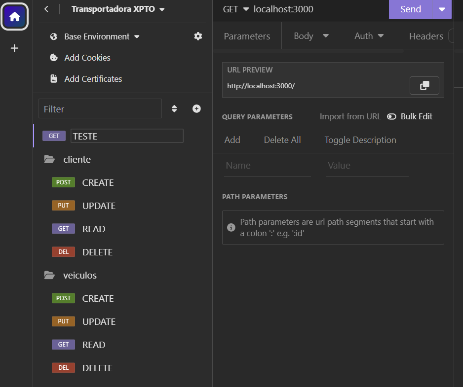

# Aula 05
## MVC
### NodeJS - Insomnia
#### Tema: Transportadora API
- Estrutura de um projeto back-end ou API
- Exemplo de um projeto com várias tabelas/entidades
- [Repositório do projeto exemplo](https://github.com/wellifabio/transportadoraxpto)
- [Avaliação Formativa](https://forms.gle/vD6LQBy4geX59Gpi8)

## Atividades
- Utilizando como base o projeto Transportadora, conclua o back-end com todos os CRUDs para as demais tabelas.
- Crie todas as requisições de teste no Insomnia criando uma pata para cada tabela

- Cliente - feito
- Veículo - feito
- Funcionario - Desenvolver Back-end e Testes com Insomnia
- Rota - Desenvolver Back-end e Testes com Insomnia
- Entrega - Desenvolver Back-end e Testes com Insomnia
- Pedido - Desenvolver Back-end e Testes com Insomnia

## Entrega
- Clone ou de um Fork no [Repositório do projeto exemplo](https://github.com/wellifabio/transportadoraxpto) conclua os CRUDS
- Exporte os testes do insomnia na pasta teste
- Envie para um repositório público chamado **transportadora**
- [Envie o link do repositório neste Formulário](https://forms.gle/aZho2XEC8x5ZvDj4A)
- Data limite para envio 20/03/2024