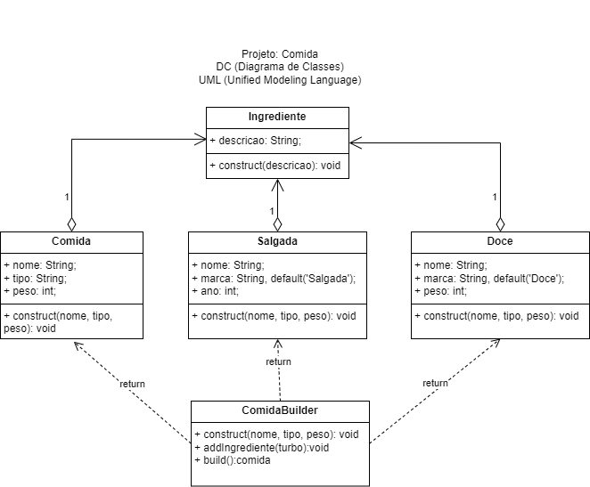

# Aula10 - Design Patterns
## Soluções clássicas

- Criação [Builder](./patterns/criacao/builder/)
- Criação [Singleton](./patterns/criacao/singleton/)

|Atividades|
|-|
|1 - Crialção, Buider, a partir do diagrama de classes a seguir modele em JavaScript uma lista com cerca de 10 comidas distintas, conforme o exemplo de carros visto em aula.|
||

[Tela no meet](https://meet.google.com/hnz-hoiy-wpw)