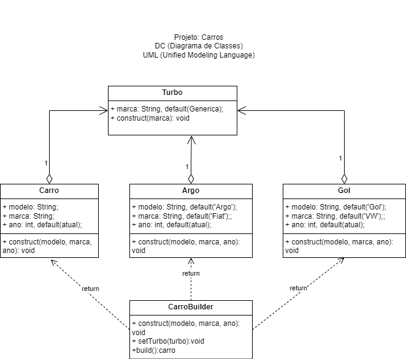

# Criação - Builder
O padrão de projeto Builder é usado para separar a construção de um objeto complexo de sua representação final, permitindo que o mesmo processo de construção possa criar diferentes representações. Aqui está um exemplo de como usar o padrão Builder em JavaScript:

|Problema 01|
|-|
|Criar vários tipos de veículos diferentes com ou sem o acessório Turbo|
||

```js
//Pattern Builder (Construtor)
//Classes com construtores
class Carro {
    constructor(modelo, marca, ano) {
        this.modelo = modelo == undefined ? '' : modelo;
        this.marca = marca == undefined ? '' : marca;
        this.ano = ano == undefined ? new Date().getFullYear() : ano;
    }
}

class Argo {
    constructor(ano) {
        this.modelo = 'Argo';
        this.marca = 'Fiat';
        this.ano = ano == undefined ? new Date().getFullYear() : ano;
    }
}

class Gol {
    constructor(ano) {
        this.modelo = 'Gol';
        this.marca = 'VW';
        this.ano = ano == undefined ? new Date().getFullYear() : ano;
    }
}

//Classe que compõe a classe Carro ou as outras
class Turbo {
    constructor(marca) {
        this.marca = marca == undefined ? 'Genérica' : marca;
    }
}

//Classe Builder - Complexa
class CarroBuilder {
    constructor(modelo, marca, ano) {
        if(modelo && marca && ano) {
            if(modelo == 'Argo') {
                this.carro = new Argo(ano);
            } else if(modelo == 'Gol') {
                this.carro = new Gol(ano);
            } else {
                this.carro = new Carro(modelo, marca, ano);
            }
        }else if(modelo && marca){
            if(modelo == 'Argo') {
                this.carro = new Argo();
            } else if(modelo == 'Gol') {
                this.carro = new Gol();
            } else {
                this.carro = new Carro(modelo, marca);
            }
        }else{
            this.carro = new Carro();
        }
    }

    setTurbo(turbo) {
        this.carro.turbo = new Turbo(turbo);
        return this;
    }

    build() {
        return this.carro;
    }
}

//Criando varios carros com o Builder
const carro1 = new CarroBuilder('Argo', 'Fiat', 2020);
const carro2 = new CarroBuilder('Gol', 'VW');
carro2.setTurbo('Garrett');
const carro3 = new CarroBuilder('Onix', 'Chevrolet');
const carro4 = new CarroBuilder();

const carros = [
    carro1.build(),
    carro2.build(),
    carro3.build(),
    carro4.build()
];

console.log(carros);
```

|Problema 02|
|-|
|Criar um produto com várias partes como alguns kits de ferramentas|
||

```javascript
//Classe Produto composta por uma lista de partes
class Produto {
    constructor(nome) {
        this.nome = nome
        this.partes = []
    }

    addPart(part) {
        this.partes.push(part)
    }

    listarPartes() {
        console.log(`Partes do ${this.nome}: ${this.partes.join(', ')}`)
    }
}

//Interface (Composta apenas pelas assinaturas dos métodos que serão construtores)
class InterfaceBuilder {
    criaParte1() { }
    criaParte2() { }
    criaParte3() { }
}

//Implemantação do primeiro construtor com apenas uma ferramenta
class Kit1Parte extends InterfaceBuilder {
    constructor(nome) {
        super()
        this.produto = new Produto(nome)
    }

    criaParte1() {
        this.produto.addPart('Furadeira')
    }

    getProduto() {
        return this.produto
    }
}

//Implemantação do segundo construtor com duas ferramenta
class Kit2Partes extends InterfaceBuilder {
    constructor(nome) {
        super()
        this.produto = new Produto(nome)
    }

    criaParte1() {
        this.produto.addPart('Furadeira')
    }

    criaParte2() {
        this.produto.addPart('Alicate')
    }

    getProduto() {
        return this.produto
    }
}

//Implemantação do terceiro construtor com três ferramenta
class Kit3Partes extends InterfaceBuilder {
    constructor(nome) {
        super()
        this.produto = new Produto(nome)
    }

    criaParte1() { this.produto.addPart('Furadeira') }

    criaParte2() {
        this.produto.addPart('Alicate')
    }

    criaParte3() {
        this.produto.addPart('Martelo')
    }

    getProduto() {
        return this.produto
    }
}

//Classe que efetiva o Pattern Builder
class Construtor {
    constructor() {
        this.builder = null
    }

    setBuilder(builder) {
        this.builder = builder
    }

    constroiUmaParte() {
        this.builder.criaParte1()
    }

    constroiTodasAsPartes() {
        this.builder.criaParte1()
        this.builder.criaParte2()
        this.builder.criaParte3()
    }
}

// Exemplo de uso
// Criar o objeto construtor e nomear cada um dos três Kits
const construtor = new Construtor()
const builder1 = new Kit1Parte("Kit Simples")
const builder2 = new Kit2Partes("Kit Básico")
const builder3 = new Kit3Partes("Kit Completo")

//Construir os três Kites
construtor.setBuilder(builder1)
construtor.constroiUmaParte()
const produto1 = builder1.getProduto()

construtor.setBuilder(builder2)
construtor.constroiTodasAsPartes()
const produto2 = builder2.getProduto()

construtor.setBuilder(builder3)
construtor.constroiTodasAsPartes()
const produto3 = builder3.getProduto()

//Ver resultados
produto1.listarPartes()
produto2.listarPartes()
produto3.listarPartes()
```

Neste exemplo, **Produto** representa o objeto complexo que será construído, **InterfaceBuilder** define a interface para a construção de diferentes partes do objeto complexo, **kit1Parte, kit2Partes, kit3Partes** implementam a interface de **InterfaceBuilder** e constroem diferentes partes do objeto complexo, **Construtor** controla o processo de construção e cria diferentes representações do objeto complexo, dependendo do Builder selecionado.

Para usar o padrão Builder, primeiro um **Construtor** deve ser criado e configurado com o Builder desejado. Em seguida, o **Construtor** usa o Builder para construir diferentes partes do objeto complexo, chamando os métodos de construção necessários. Quando a construção estiver concluída, o Builder retorna o objeto complexo final usando o método **getProduto()**.