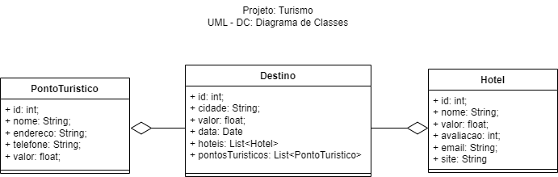

# Aula11
Link Meet : [https://meet.google.com/kpn-gssa-ved]

## ORM - Prisma
- ORM (Object Relationchip Management) Gerenciamento de Objeto Relacional
- PRISMA - Framework de ORM
- Padrão de projeto MVC
- Documentação prisma.io

## Conhecimentos
- 5 Web Services
- 5.1 Definição
- 5.2 Integração de plataformas utilizando API
- 5.3 Notificação entre cliente servidor utilizando Web Services

## Iniciar um projeto com Prisma
- 1 Criar uma pasta para o projeto
- 2 Abrir com VsCode
- 3 Abrir um termina **CTRL + "** cmd ou bash e instalar o framework globalmente
```bash
npm i -g prisma
```
- 4 Iniciar o projeto com o ORM Prisma e a biblioteca do SGBD, em nosso casso o MySQL MariaDB
```bash
prisma init --datasource-provider mysql
```
- 5 Editar o arquivo com a **variável de ambiente** com a **string** de conexão com o Banco de dados, quando o App for implantado esta string será alterada com as configuraçõe do servidor SGBD
<br>.env
```js
DATABASE_URL="mysql://root:@localhost:3306/nome_banco_de_dados"
```
- 6 Criar os **Modelos** de tabelas e relacionamentos no arquivo ./prisma/shema.prisma conforme exemplo a seguir<br>shema.prisma
```js
generator client {
  provider = "prisma-client-js"
}

datasource db {
  provider = "mysql"
  url      = env("DATABASE_URL")
}

model Clientes {
  id Int @id @default(autoincrement())
  nome String @db.VarChar(255)
  cpf String @db.VarChar(14) @unique
  email String? @db.VarChar(255)
  telefones Telefones[]
}

model Telefones {
  id Int @id @default(autoincrement())
  id_cliente Int 
  telefone String @db.VarChar(20) @unique
  cliente Clientes @relation(fields: [id_cliente], references: [id])
}
```
- 7 Executar a primeira migração, com o XAMPP aberto e iniciados MySQL, acesse o terminal
```bash
prisma migrate dev --name init
```
- 8 Editar os **controles** ciando os CRUDs conforme exemplo a seguir<br>./src/controllers/clientes.js
```js
const { PrismaClient } = require('@prisma/client');

const prisma = new PrismaClient();

const create = async (req, res) => {
    const data = req.body;

    console.log(data);

    const cliente = await prisma.clientes.create({
        data
    });

    res.status(201).json(cliente).end();
}

const read = async (req, res) => {
    const clientes = await prisma.clientes.findMany({
        include : {
            telefones : true
        }
    });

    res.status(200).json(clientes).end();
}

const readById = async (req, res) => {
    const cliente = await prisma.clientes.findUnique({
        where : {
            id : Number(req.params.id)
        },
        include : {
            telefones: {
                select : {
                    telefone: true
                }
            }
        }
    });

    res.status(200).json(cliente).end();
}

const readByName = async (req, res) => {
    const { nome } = req.body;

    const clientes = await prisma.clientes.findMany({
        where : {
            nome : {
                contains : nome
            }
        }
    });

    res.status(200).json(clientes).end();
}

//localhost:3000/clientes/1
const remove = async (req, res) => {
    const cliente = await prisma.clientes.delete({
        where: {
            id: Number(req.params.id)
        }
    });

    res.status(200).json(cliente).end();
}

//param id
//body info
const update = async (req, res) => {
    const id = Number(req.params.id);
    const data = req.body;

    const cliente = await prisma.clientes.update({
        where: {
            id
        },
        data
    });

    res.status(200).json(cliente).end();
}

module.exports = {
    create,
    read,
    remove,
    update,
    readById,
    readByName,
}
```
- 7 Criar as rotas<br>./src/routes.js
  
```js
const express = require('express');

const router = express.Router();

const clientes = require('./controllers/clientes');
const telefones = require('./controllers/telefones');

router.get('/', (req, res) => {
    res.send('Hello World').end();
});

//Clientes
router.post('/clientes', clientes.create);
router.get('/clientes', clientes.read);
router.delete('/clientes/:id', clientes.remove);
router.put('/clientes/:id', clientes.update);

router.get('/cliente/:id', clientes.readById);
router.post('/clientes/nome', clientes.readByName);


module.exports = router;
```
- 8 editar o server <br>server.js
```js
const express = require('express');
const cors = require('cors');

const app = express();

const router = require('./src/routes');

app.use(express.json());
app.use(cors());
app.use(router);

app.listen(3000, () => {
    console.log("Running on 3000");
});
```
- 9 Executar a API
```bash
nodemon
```
- 10 Testar com **Insomnia**, **Postman** ou outra ferramenta de teste unitário.

|Projeto|
|-|
|API para uma Agência de viágens com três tabelas Destinos[id, cidade, valor, data], Hoteis[id, nome, valor, avaliacao, email, site] e PontosTuristicos[nome, endereco, telefone, valor]|
||

|Contextualização|
|-|
|Como programador freelance você aceitou um projeto para uma pequena **agência de viagens**, onde o Cliente solicita um site para cadastrar os destinos, hotéis e pontos turísticos, como o projeto possuirá poucos dados e você que irá iniciá-lo, utilize o conhecimento adquirido com o **framework prisma**.||

|Desafio|
|-|
|2 Criar um Front-End para consumir e enviar dados para esta API.<br> - RF001: Tela inicial com todos os destinos<br> - RF002: Cadastro de destinos<br> - RF003: Cadastro de Hotéis<br> - RF004: Cadastro de pontos turísticos<br> - RF005: Funcionalidades CRUDs para as três entidades|

|Entregas|
|-|
|Repositório do github com o projeto e envie o [link neste formulário](https://docs.google.com/forms/d/e/1FAIpQLSdrTAVX52Mfl5DhzYKBvNOxyit9ZsnjVGNuNA9dGnLveBwaOA/viewform?usp=sf_link)|