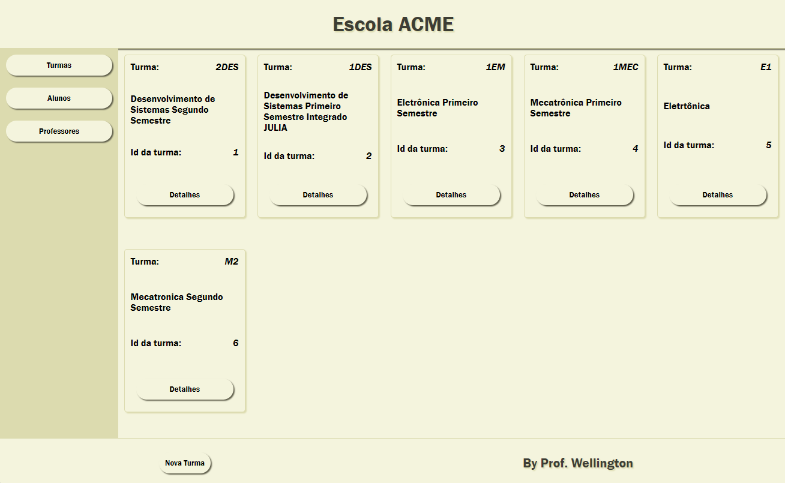
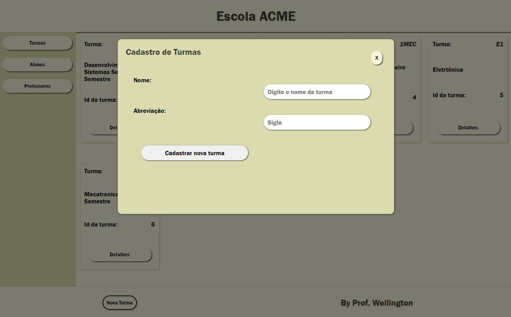
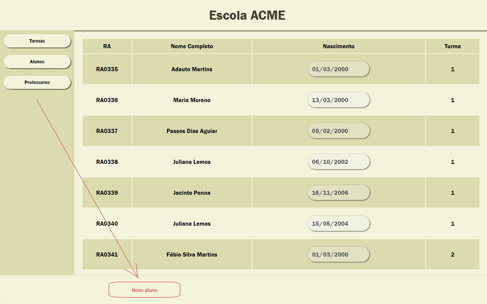

# Aula12 - App BackEnd
## NodeJS + EJS ou PUG
### Ferramentas de produtividade
- Prisma
- Pug ou EJS
Quando necessário uma aplicação **Fullstack** que seja simples (BD com 2 a 3 tabelas) podemos integrar o APP em um só produto. Nesta aula vamos ver um exemplo.

### [Projeto Modelo](https://github.com/wellifabio/escolaprismapug.git)
Em aula vimos uma demonstração de como **renderizar** dados com **pug** e criar um modal para cadastrar uma nova turma.

#### Desafio
Crie um botão e modal para cadastrar novo aluno

Pesquise na Web/chatGPT como criar as outras funcionalidades CRUD, update e Delete com Pug e implemente neste projeto.
