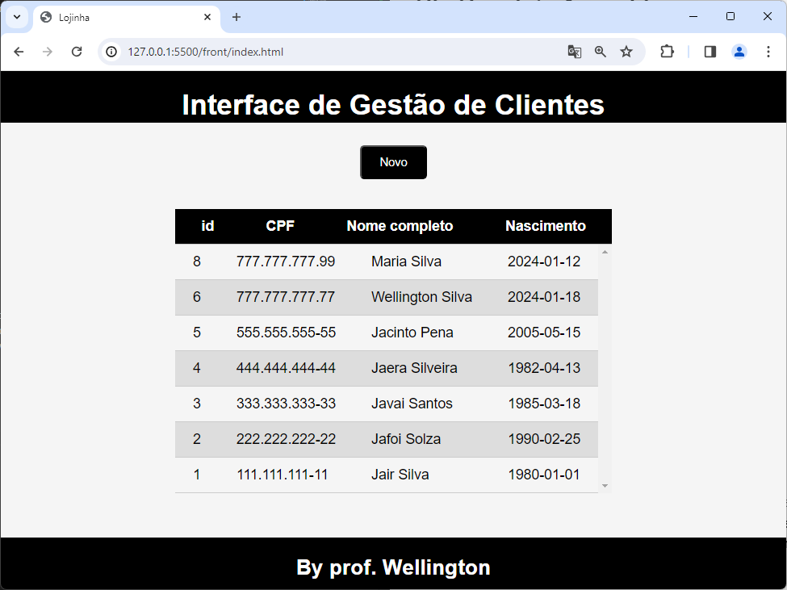
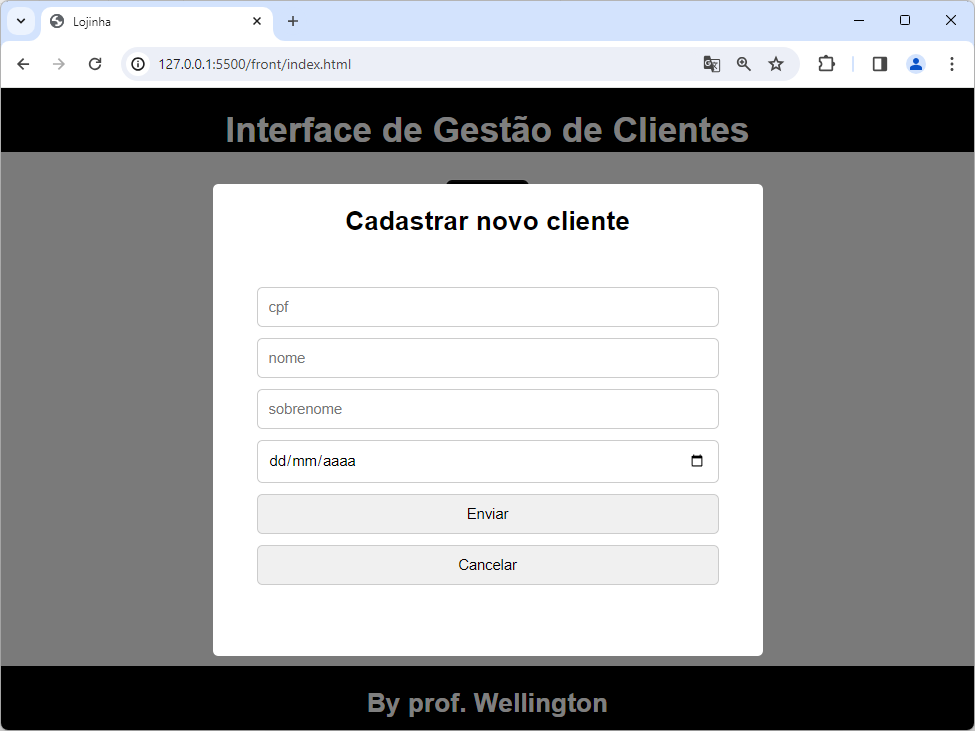
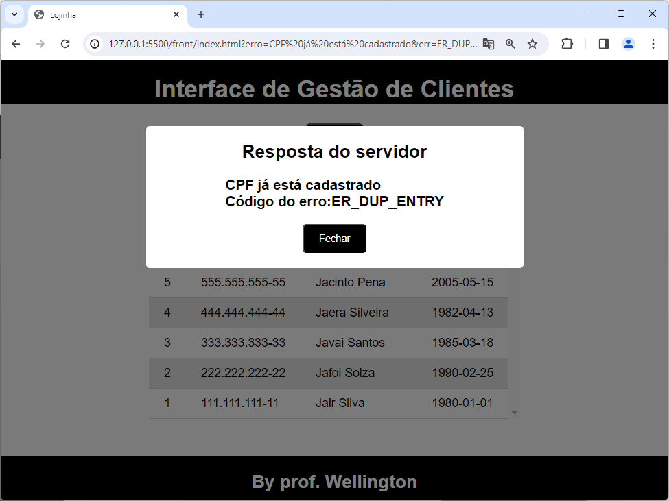

# Aula01

# O que é programação Front-End
Interfaçe de usuário - Parte visual onde o usuário interage com a aplicação Web.

## UI - User Interface - Linguagens
- HTML
- CSS
- JavaScript

## Frameworks
- Bootstrap
- React
- Angular

## Conhecimentos
- 1. JavaScript
    - 1.1. Operadores
        - 1.1.1. Aritméticos
        - 1.1.2. Relacionais
        - 1.1.3. Lógicos

# Exemplo
Em continuidade ao sistema Fullstak criado nas aulas1 e 2 de Back-End, segue um exemplo de UI (User Interface) integrada em uma única página que **lista os clientes em uma tabela**, cadastra um novo através de um **modal** e mostra mensagens do servidor também em um **modal**

- Exemplo em ./lojinha

## Telas
Tela principal

Modal de cadastro

Modal de mensagens

## Atividade FullStack (Continuidade da atividade da aula02 de back-end)
Utilizando como modelo o projeto **Lojinha**, em duplas, escolha um dos temas a seguir e desenvolva um projeto full-stack.
- Patrimônio/Inventário
- Produtos da cantina
- Livros em uma Biblioteca
- Produtos em uma papelaria
- Cadastro de Filmes preferidos
- Cadastro de Músicas preferidas
- Outro conforme sua criatividade, desde que envolva apena uma tabela em um banco dedados.
- Estilize a página como preferir, em páginas separadas ou em apenas uma conforme este exemplo

### Entrega:
- 01/02/2024 em um repositório público do github, o forms estará na aula02 de back-end