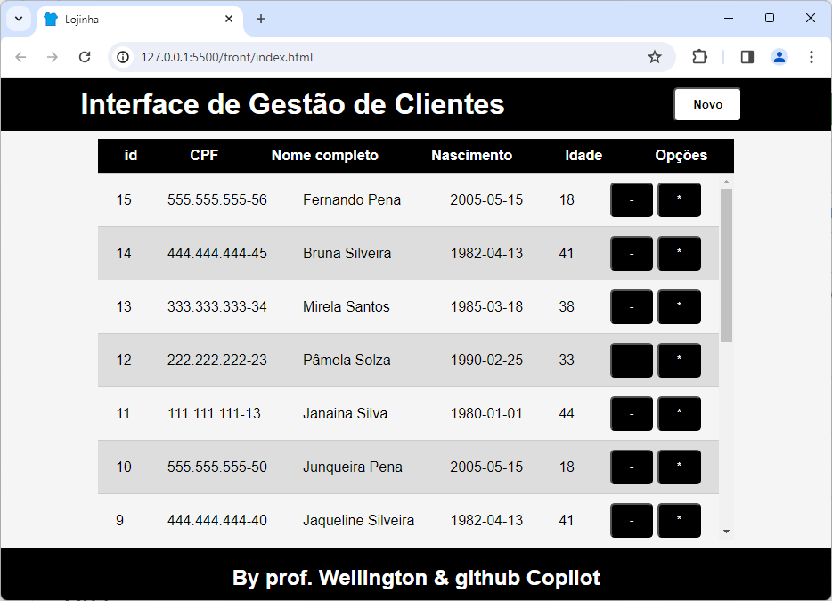
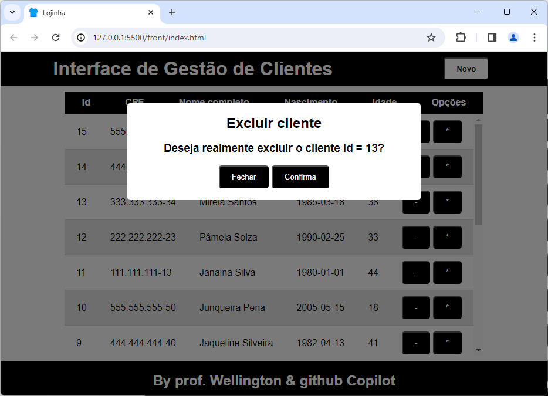
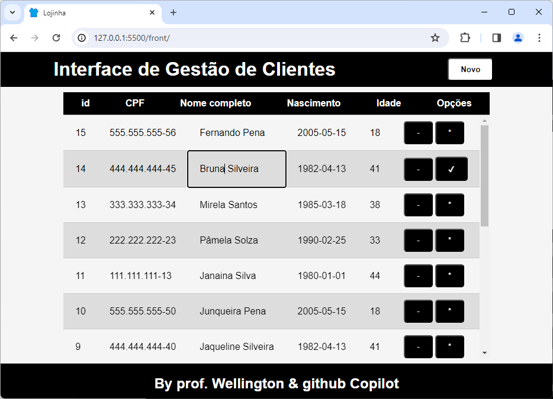

# Aula03

# Conhecimentos
- Modal Cadastro
- Tabelas editaveis

## Exemplo
Em continuidade ao sistema Fullstak criado nas aulas3 de Back-End, **CRUD** completo adicionando as funcionalidades UPDATE e DELETE implementaremos estas funcionalidades, porém em **uma página só** e consumindo corretamente a API.

## Telas

## Aplicamos técnicas de UI / UX:
- UI User interface - HTML + CSS para estilizar a página
    - Responsividade
    - Dimenções responsivas
    - Acessibilidade - Contraste
- UX User experience
    - HTML5 no formulário, campos de data
    - Modais
    - Funcionalidades em uma só página
    - Modal para mensagens de erro e confirmação
