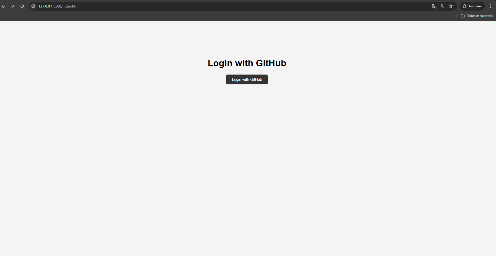

# AULA 11 - Utilizando API para login

As APIs são usadas para integrar novas aplicações com sistemas de software existentes. Isso aumenta a velocidade de desenvolvimento porque cada funcionalidade não precisa ser escrita do zero. Você pode usar APIs para aproveitar o código existente.

# Utilizando API de Login
 
[ OAHT Github:](https://github.com/settings/apps)

A pagina vai ficar assim

