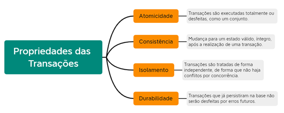

# Tipos de bancos de dados
- Não estruturado
  - TXT
  - DOC
  - PDF
  - XLS (Excel)
- Semi-estruturado
  - XML
  - JSON
- Estruturado
	- SGBD (Sistema Gerenciador de Banco de Dados)
	- Sem SGBD = CSV
	- Com SGBD
		- Não SQL (Ex: MongoDB, FireBase ...)
			- Não Relacional
		- SQL (Ex: Mysql, Oracle, SQL Server, Postgres, FireBird ...)
			- Relacionais
## Abiente de desenvolvimento
- XAMPP
- VSCode
- Git
- MySQL Workbanck

## Scripts SQL

- DDL

```sql
-- Criar um banco de dados
create database lojinha;

-- Listar todos os bancos de dados
show databases;

-- Acessar o banco de dados
use lojinha;

-- Excluir um banco de dados
drop database lojinha;
```

- Tabela

```sql
-- Exclui um banco de dados se existir (DEV)
drop database if exists lojinha;
create database lojinha;
use lojinha;

-- Criar uma tabela de Clientes
create table Clientes(
    id integer primary key not null auto_increment,
    cpf varchar(20) not null unique,
    nome varchar(50) not null,
    sobrenome varchar(50) not null,
    nascimento date not null
);

-- Ver a estrutura da tabela
describe Clientes;

-- Ver todas as tabelas
show tables;

-- Excluir uma tabela
drop table Clientes;

-- Ver todas as tabelas
show tables;
```

## Chave
	- Campo único que identifica o registro (A linha inteira de dados)
	- Chave Primária (Não se repete na tabela)
	- Chave Estrangeira (Se repete na tabela e sempre faz referência a uma chave primária em outra tabela)

## ACID
Estas são as quatro principais características de um banco de dados relacional/transacional
