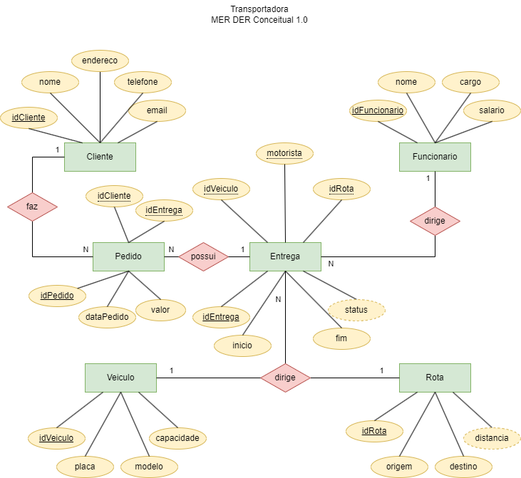

# Aula04
## Exemplos de projetos de bancos de dados relacionais
### Transportadora
#### MER - Dicionário de dados
- Cliente(idCliente [chave primária], nome, endereco, telefone, email);
- Funcionario(idFuncionário [chave primária], nome, cargo, salario);
- Veiculo(idVeiculo [chave primária], placa, modelo, capacidade);
- Rota(idRota [chave primária], origem, destino, distancia);
- Entrega(idEntrega [chave primária], inicio, fim, status (Em andamento, Concluída, Atrasada),idRota[chave estrangeira referencia Rota(idRota)], idVeiculo [chave estrangeira referencia Veiculo(idVeidulo)], motorista [chave estrangeira referencia Funcionario(idFuncionario)]);
- Pedido(idPedido [chave primária], dataPedido, valor, idCliente[chave estrangeira referencia Cliente(idCliente)], idEntrega[chave estrangeira referencia Entrega[idEntrega]]);
#### MER - DER Conceitual
