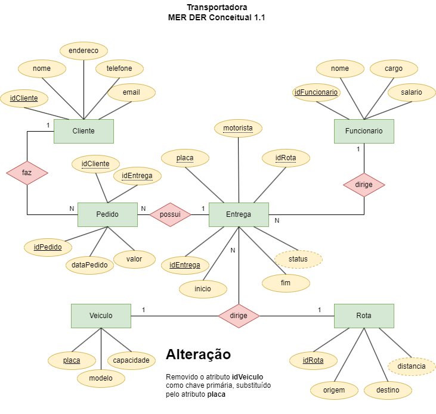

# Aula04
## Exemplos de projetos de bancos de dados relacionais
### Transportadora
#### MER - Dicionário de dados
- Cliente(idCliente [chave primária], nome, endereco, telefone, email);
- Funcionario(idFuncionário [chave primária], nome, cargo, salario);
- Veiculo(idVeiculo [chave primária], placa, modelo, capacidade);
- Rota(idRota [chave primária], origem, destino, distancia);
- Entrega(idEntrega [chave primária], inicio, fim, status (Em andamento, Concluída, Atrasada),idRota[chave estrangeira referencia Rota(idRota)], idVeiculo [chave estrangeira referencia Veiculo(idVeidulo)], motorista [chave estrangeira referencia Funcionario(idFuncionario)]);
- Pedido(idPedido [chave primária], dataPedido, valor, idCliente[chave estrangeira referencia Cliente(idCliente)], idEntrega[chave estrangeira referencia Entrega[idEntrega]]);
#### MER - DER Conceitual



#### Script SQL DDL
```sql
drop database if exists transportadora;
create database transportadora CHARSET=UTF8 COLLATE utf8_general_ci;
use transportadora;

-- DDL - CREATE
create table Cliente(
    idCliente int not null primary key auto_increment,
    nome varchar(100) not null,
    endereco varchar(100) not null,
    telefone varchar(15) not null,
    email varchar(100) not null
);
create table Funcionario(
    idFuncionario int not null primary key auto_increment,
    nome varchar(100) not null default("Motorista"),
    cargo varchar(30) not null,
    salario float(10,2) not null
);
create table Rota(
    idRota int not null primary key auto_increment,
    origem varchar(100) not null,
    destino varchar(100) not null,
    distancia float(10,2)
);
create table Veiculo(
    placa varchar(10) not null primary key,
    modelo varchar(20) not null,
    capacidade float(10,2)
);

create table Entrega(
    idEntrega int not null primary key auto_increment,
    placa varchar(10) not null,
    motorista int not null,
    idRota int not null,
    inicio datetime,
    fim datetime,
    status varchar(20)
);

create table pedido(
    idPedido int not null primary key auto_increment,
    idCliente int not null,
    idEntrega int not null,
    dataPedido timestamp not null,
    valor float(50,2) not null
);
-- DDL - ALTER
alter table Pedido add foreign key (idCliente) references Cliente(idCliente);
alter table Pedido add foreign key (idEntrega) references Entrega(idEntrega);

alter table Entrega add foreign key (placa) references Veiculo(placa);
alter table Entrega add foreign key (motorista) references Funcionario(idFuncionario);
alter table Entrega add foreign key (idRota) references Rota(idRota);

show tables;

```