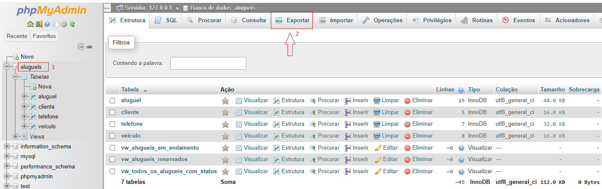
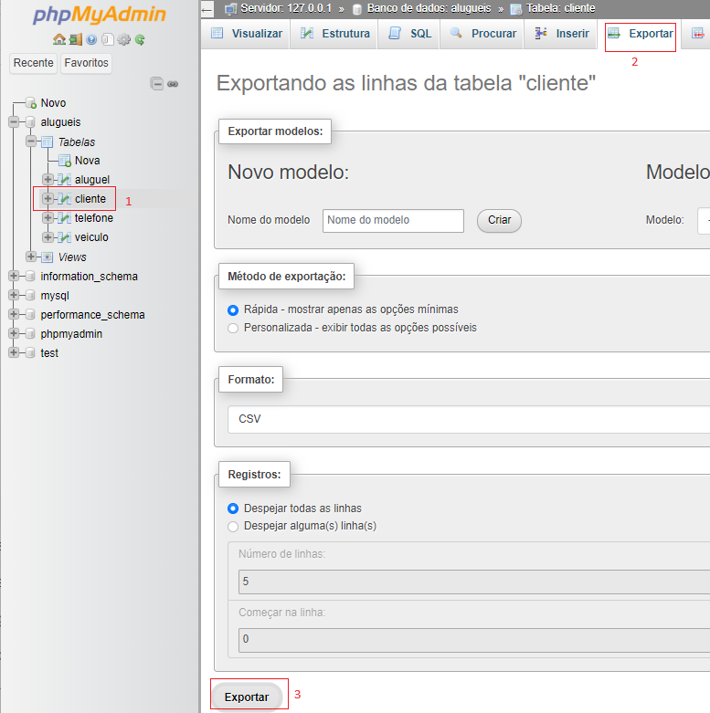

# Aula09
## Importação e exportação de dados
Podemos importar e exportar os dados ou a estrutura completa de um banco de dados, a seguir temos um script de criação e população de um banco de dados de exemplo. Abra o XAMPP e instale este banco de dados através do PhpMyadmin ou via shell.
```sql
DROP DATABASE IF EXISTS alugueis;
CREATE DATABASE alugueis CHARSET=UTF8 COLLATE utf8_general_ci;
USE alugueis;

CREATE TABLE Cliente (
    cpf VARCHAR(14) NOT NULL primary key,
    nome_cliente VARCHAR(100) NOT NULL
);

CREATE TABLE Telefone (
    cpf VARCHAR(14),
    numero VARCHAR(15) NOT NULL UNIQUE,
    foreign key (cpf) references Cliente(cpf)
);

CREATE TABLE Veiculo (
    placa VARCHAR(8) NOT NULL primary key,
    modelo VARCHAR(100) NOT NULL,
    marca VARCHAR(100) NOT NULL,
    tipo ENUM('standart', 'utilitario', 'esportivo') NOT NULL,
    diaria DECIMAL(10,2) NOT NULL
);

CREATE TABLE Aluguel (
    id INT NOT NULL primary key AUTO_INCREMENT,
    placa VARCHAR(8) NOT NULL,
    cpf VARCHAR(14) NOT NULL,
    reserva DATE NOT NULL,
    retirada DATE DEFAULT NULL,
    devolucao DATE DEFAULT NULL,
    subtotal DECIMAL(10,2) DEFAULT 0.00 NOT NULL,
    foreign key (cpf) references Cliente(cpf),
    foreign key (placa) references Veiculo(placa)
);

insert into Cliente Values
('111.111.111-11','Osvaldo Oliveira'),
('222.222.222-22','Jaqueline Teixeira'),
('333.333.333-33','Keli Matos'),
('444.444.444-44','Ursula Souza'),
('555.555.555-55','Evandro Silva');

insert into Telefone values
('111.111.111-11','19-72077-0521'),
('111.111.111-11','19-06078-6843'),
('222.222.222-22','19-23003-4864'),
('333.333.333-33','19-06486-6449'),
('333.333.333-33','19-53266-7923'),
('444.444.444-44','19-64378-2404'),
('555.555.555-55','19-53315-2734');

insert into Veiculo values
('DEA-7981','Uno','Fiat','standart',100),
('CBC-4945','Fiorino','Fiat','utilitario',120),
('BEE-7735','Saveiro','VW','standart',100),
('CBA-4403','Sandeiro','Renaut','standart',100),
('BBC-8504','Palio','Fiat','standart',100),
('BEB-5885','Gol','VW','standart',100),
('EDB-2475','Ranger','Ford','esportivo',200),
('CBC-4901','Fiorino','Fiat','utilitario',120);

insert into Aluguel values 
(01,'DEA-7981','111.111.111-11',DATE_SUB(CURDATE(),INTERVAL 45 DAY),DATE_SUB(CURDATE(),INTERVAL 45 DAY),DATE_SUB(CURDATE(),INTERVAL 40 DAY),0), 
(02,'CBC-4945','222.222.222-22',DATE_SUB(CURDATE(),INTERVAL 45 DAY),DATE_SUB(CURDATE(),INTERVAL 44 DAY),DATE_SUB(CURDATE(),INTERVAL 34 DAY),0), 
(03,'BEE-7735','333.333.333-33',DATE_SUB(CURDATE(),INTERVAL 43 DAY),DATE_SUB(CURDATE(),INTERVAL 42 DAY),DATE_SUB(CURDATE(),INTERVAL 32 DAY),0), 
(04,'CBA-4403','444.444.444-44',DATE_SUB(CURDATE(),INTERVAL 40 DAY),DATE_SUB(CURDATE(),INTERVAL 39 DAY),DATE_SUB(CURDATE(),INTERVAL 29 DAY),0), 
(05,'BBC-8504','444.444.444-44',DATE_SUB(CURDATE(),INTERVAL 35 DAY),DATE_SUB(CURDATE(),INTERVAL 35 DAY),DATE_SUB(CURDATE(),INTERVAL 25 DAY),0), 
(06,'BEB-5885','111.111.111-11',DATE_SUB(CURDATE(),INTERVAL 35 DAY),DATE_SUB(CURDATE(),INTERVAL 35 DAY),DATE_SUB(CURDATE(),INTERVAL 20 DAY),0), 
(07,'EDB-2475','111.111.111-11',DATE_SUB(CURDATE(),INTERVAL 35 DAY),DATE_SUB(CURDATE(),INTERVAL 35 DAY),DATE_SUB(CURDATE(),INTERVAL 30 DAY),0), 
(08,'CBC-4901','444.444.444-44',DATE_SUB(CURDATE(),INTERVAL 30 DAY),DATE_SUB(CURDATE(),INTERVAL 30 DAY),DATE_SUB(CURDATE(),INTERVAL 20 DAY),0), 
(09,'EDB-2475','111.111.111-11',DATE_SUB(CURDATE(),INTERVAL 28 DAY),DATE_SUB(CURDATE(),INTERVAL 27 DAY),DATE_SUB(CURDATE(),INTERVAL 15 DAY),0), 
(10,'DEA-7981','444.444.444-44',DATE_SUB(CURDATE(),INTERVAL 26 DAY),DATE_SUB(CURDATE(),INTERVAL 26 DAY),DATE_SUB(CURDATE(),INTERVAL 10 DAY),0), 
(11,'CBA-4403','555.555.555-55',DATE_SUB(CURDATE(),INTERVAL 26 DAY),DATE_SUB(CURDATE(),INTERVAL 26 DAY),DATE_SUB(CURDATE(),INTERVAL 13 DAY),0), 
(12,'BBC-8504','333.333.333-33',DATE_SUB(CURDATE(),INTERVAL 25 DAY),DATE_SUB(CURDATE(),INTERVAL 24 DAY),DATE_SUB(CURDATE(),INTERVAL 20 DAY),0), 
(13,'BEE-7735','222.222.222-22',DATE_SUB(CURDATE(),INTERVAL 23 DAY),DATE_SUB(CURDATE(),INTERVAL 22 DAY),DATE_SUB(CURDATE(),INTERVAL 11 DAY),0), 
(14,'BEB-5885','111.111.111-11',DATE_SUB(CURDATE(),INTERVAL 20 DAY),DATE_SUB(CURDATE(),INTERVAL 20 DAY),DATE_SUB(CURDATE(),INTERVAL 5 DAY),0), 
(15,'CBA-4403','555.555.555-55',DATE_SUB(CURDATE(),INTERVAL 19 DAY),DATE_SUB(CURDATE(),INTERVAL 19 DAY),DATE_SUB(CURDATE(),INTERVAL 3 DAY),0), 
(16,'BEE-7735','333.333.333-33',DATE_SUB(CURDATE(),INTERVAL 17 DAY),DATE_SUB(CURDATE(),INTERVAL 16 DAY),DATE_SUB(CURDATE(),INTERVAL 1 DAY),0), 
(17,'BBC-8504','444.444.444-44',DATE_SUB(CURDATE(),INTERVAL 15 DAY),DATE_SUB(CURDATE(),INTERVAL 15 DAY),DATE_SUB(CURDATE(),INTERVAL 5 DAY),0), 
(18,'CBC-4945','444.444.444-44',DATE_SUB(CURDATE(),INTERVAL 15 DAY),DATE_SUB(CURDATE(),INTERVAL 15 DAY),null,0), 
(19,'DEA-7981','555.555.555-55',DATE_SUB(CURDATE(),INTERVAL 14 DAY),DATE_SUB(CURDATE(),INTERVAL 14 DAY),null,0), 
(20,'EDB-2475','555.555.555-55',DATE_SUB(CURDATE(),INTERVAL 10 DAY),DATE_SUB(CURDATE(),INTERVAL 10 DAY),null,0), 
(21,'CBA-4403','222.222.222-22',DATE_SUB(CURDATE(),INTERVAL 2 DAY),'2024-03-28',null,0), 
(22,'BEB-5885','222.222.222-22',DATE_SUB(CURDATE(),INTERVAL 2 DAY),'2024-03-23',null,0), 
(23,'BBC-8504','222.222.222-22',DATE_SUB(CURDATE(),INTERVAL 1 DAY),null,null,0), 
(24,'DEA-7981','111.111.111-11',CURDATE(),null,null,0), 
(25,'CBC-4945','222.222.222-22',CURDATE(),null,null,0);

-- Atualizando a tabela Aluguel com o subtotal
update Aluguel set subtotal = datediff(devolucao, retirada) * (select diaria from Veiculo where placa = Aluguel.placa);

-- Crie um relatorio semelhante ao anterior porém acrescido de uma coluna status que informa se o aluguel está concluído, em andamento ou reservado e salve com o nome vw_todos_os_alugueis_com_status
create view vw_todos_os_alugueis_com_status as
select a.*, c.nome_cliente, v.modelo, v.marca, 
case
    when devolucao is null and retirada is null then 0
    when devolucao is null then datediff(curdate(), retirada)
    else datediff(devolucao, retirada) 
end as dias,
if(retirada is null,0,if(devolucao is null,datediff(curdate(), retirada),datediff(devolucao, retirada))) * (select diaria from Veiculo where placa = a.placa) as sub_calc,
case
    when devolucao is not null then 'Concluído'
    when devolucao is null and retirada is not null then 'Em andamento'
    else 'Reservado'
end as status   
from Aluguel a
left join Cliente c on a.cpf = c.cpf
left join Veiculo v on a.placa = v.placa;

-- Crie um relatório que mostre somente os aluguéis reservados e salve com o nome vw_alugueis_reservados
create view vw_alugueis_reservados as
select * from vw_todos_os_alugueis_com_status where status = 'Reservado';

-- Crie um relatório que mostre somente os aluguéis em andamento e salve com o nome vw_alugueis_em_andamento
create view vw_alugueis_em_andamento as
select * from vw_todos_os_alugueis_com_status where status = 'Em andamento';

-- Ver todos os dados
select * from Cliente;
select * from Telefone;
select * from Veiculo;
select * from Aluguel;
select * from vw_todos_os_alugueis_com_status;
select * from vw_alugueis_reservados;
select * from vw_alugueis_em_andamento;
```

## Exportação no formato SQL
- Neste caso temos o script de criação e população do banco de dados, porém se uma empresa já possuísse um banco de dados antigo e nosso trabalho seria transferir para um novo modelo podemos seguir os seguintes passos.
- 1 Abrir o PhpMyadmin, clicar no nome do banco de dados.
- 2 Clicar em exportar
- 3 Escolher o tipo SQL e clicar no botão exportar
- 
- Não é necessário criar um modelo se a exportação não for contínua.
- Este formato só serve para transferir os dados para outro banco de dados do mesmo SGBD (MySQL:MariaDB) se os dados forem transferidos para outros bancos de dados precisamos exportar tabela por tabela.
### Exportação no formato CSV
- Para exportar para outros bancos de dados como Oracle, SQL Server ou até bancos de dados não relacionais utilizamos formatos **universais** como CSV
- Porém precisamos exportar tabela por tabela, conforme passos a seguir
- 1 Clique na tabela
- 2 Clique em exportar
- 3 Escolha o formato, escolha se quer toda a tabela ou um total de linhas e clique em **exportar**
- 
## Importação de dados em CSV
- Para importar no formato SQL, basta executar o script conforme fizemos no início da aula, já no formato CSV vamos utilizar um banco de dados de exemplo chamado **pedidos** neste repositório
- 1 Baixe os cinco arquivos CSV da pasta pedidos.
- 2 Execute o script de **criação** do **bando de dados**
```sql
DROP DATABASE IF EXISTS pedidos;
CREATE DATABASE pedidos CHARSET=UTF8 COLLATE utf8_general_ci;
USE pedidos;

CREATE TABLE Cliente (
    id integer not null primary key auto_increment,
    cpf VARCHAR(14) NOT NULL unique,
    nome VARCHAR(100) NOT NULL,
    cep VARCHAR(50) not null,
    numero VARCHAR(10),
    complemento VARCHAR(100)
);

CREATE TABLE Telefone (
    id_cliente integer not null,
    telefone VARCHAR(15) NOT NULL UNIQUE,
    foreign key (id_cliente) references Cliente(id)
);

CREATE TABLE Produto (
    id integer not null primary key auto_increment,
    nome VARCHAR(100) NOT NULL,
    preco float(10,2) not null
);

CREATE TABLE Entregador (
    id integer not null primary key auto_increment,
    nome VARCHAR(100) NOT NULL,
    veiculo VARCHAR(30) not null
);

CREATE TABLE Pedido (
    id integer not null primary key auto_increment,
    id_cliente integer not null,
    id_entregador integer not null,
    data Date NOT NULL,
    hora_pedido time not null,
    hora_entrega time,
    hora_fim time,
    quantidade integer not null,
    id_produto integer not null,
    preco_unitario  float(10,2) not null,
    foreign key (id_cliente) references Cliente(id),
    foreign key (id_entregador) references Entregador(id)
);
```

- 3 Execute o script de **importação** dos dados em **CSV** para cada tabela.
```sql
LOAD DATA INFILE 'C:/users/des/clientes.csv'
INTO TABLE cliente
FIELDS TERMINATED BY ';'
ENCLOSED BY '"'
LINES TERMINATED BY '\r\n'
IGNORE 1 ROWS;
```