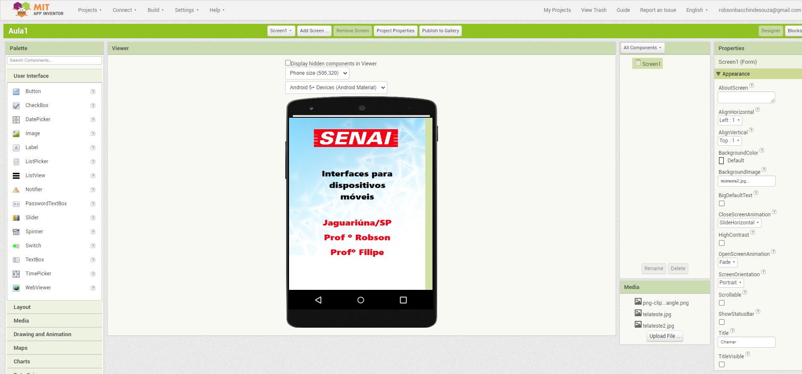
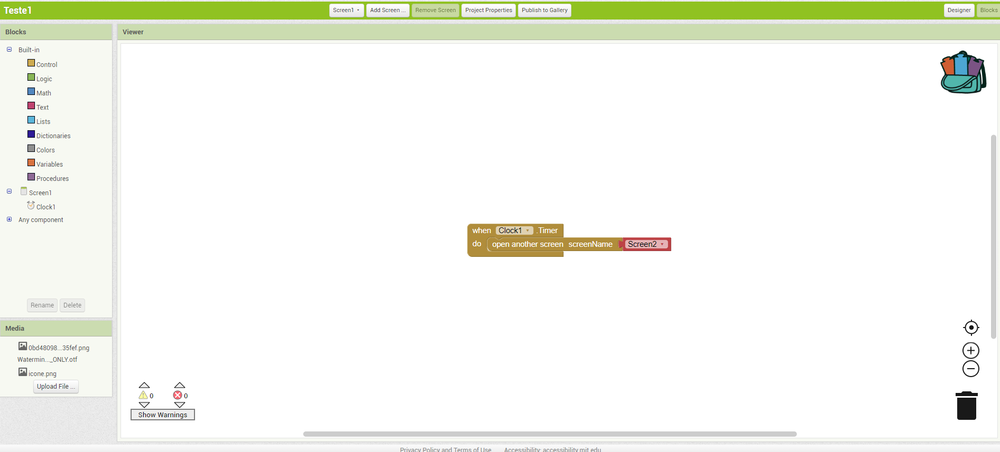
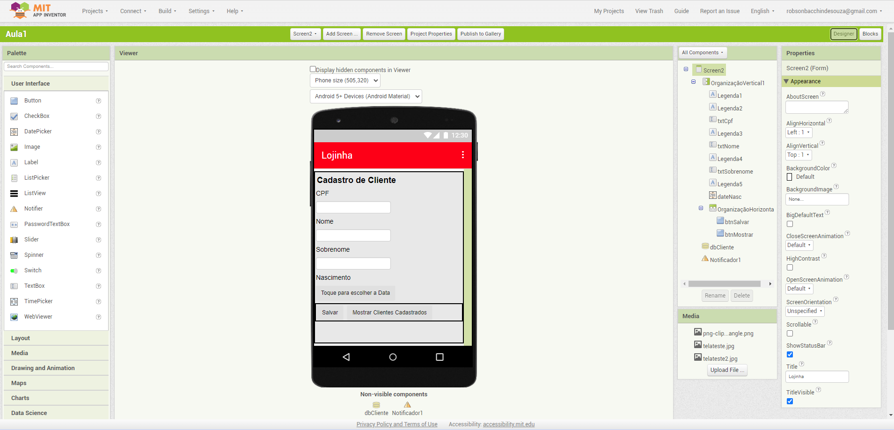
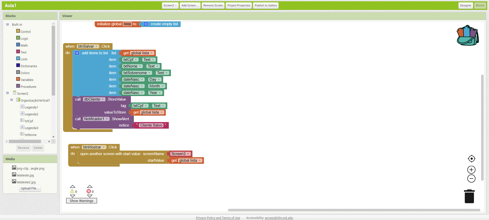
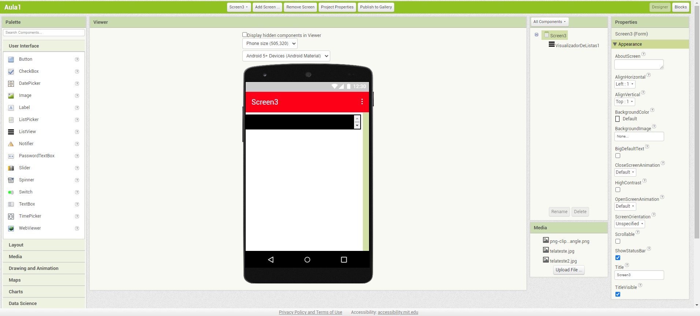
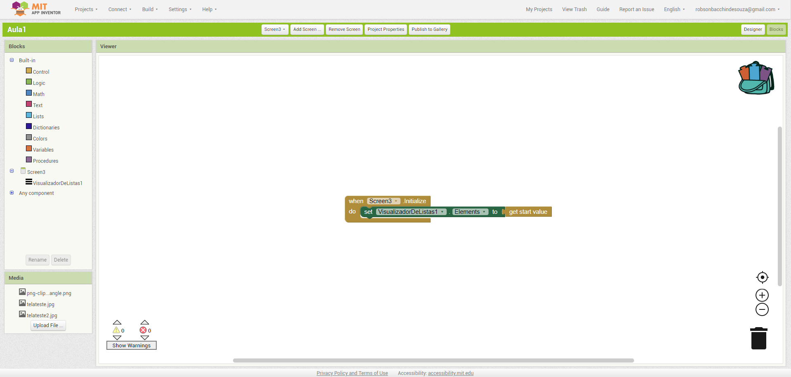

# Interface para Dispositivos Móveis - Aula01
## Conhecimentos
- 1. Dispositivos móveis
	- 1.1. Definição
	- 1.2. Histórico
	- 1.3. Características
	- 1.4. Arquitetura
	- 1.5. Ambiente de desenvolvimento
		- 1.5.1.Instalação e configuração
		- 1.5.2.Gerenciamento de dependências
		- 1.5.3.Recursos e interfaces
## MIT APP INVENTOR
    #### Utilização do MIT app Inventor para realização de aplicativo com lógica de bloco
    - https://appinventor.mit.edu/

# Tela 1 - Tela de Splash (Screen1)
 

# Tela 1 - Tela de Splash (Screen1/Blocos)    

# Tela 2 - Tela de Cadastro (Screen2)

# Tela 2 - Tela de Cadastro (Screen2/Blocos)   

# Tela 3 - Tela de Mostrar Cadastro (Screen3)

# Tela 2 - Tela de Mostrar Cadastro (Screen3/Blocos)   

