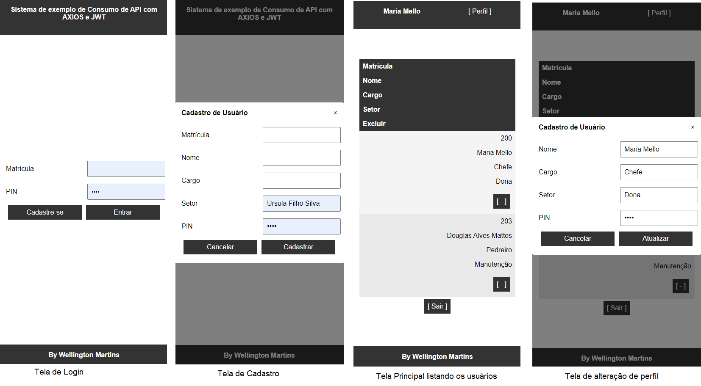

# Sistema de Usuários e Login
Exemplo de sistema fullstack de usuários e login com as seguintes fncionalidade, Autenticação **JWT**, ORM **Prisma** e Consumo de API com **Axios**.

## Para testar
- 1 Clonar este repositório
- 2 Abrir com o VS code
- 3 Na pasta ./api criar um arquivo .env contendo:
```js
DATABASE_URL="mysql://root@localhost:3306/usuarios?schema=public&timezone=UTC"
```
- 4 Abrir XAMPP e clicar em Start nos serviços Mysql e Apache.
- 5 Instalar as dependências e o banco de dados
```bash
cd api 
npm i
npx prisma migrate dev --name init
```
- 6 Voltar ao VsCode e Exercutar a API
```bash
npx nodemon
```
- 7 Acessar a pasta ./front
- 8 Exercutar o arquivos index.html com live server