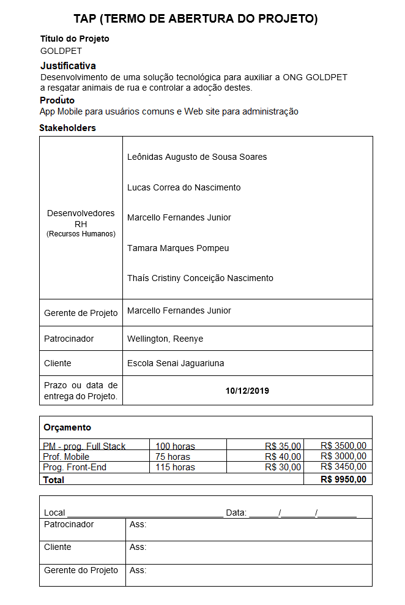
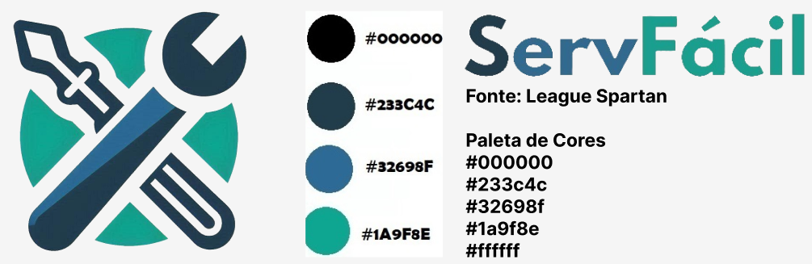
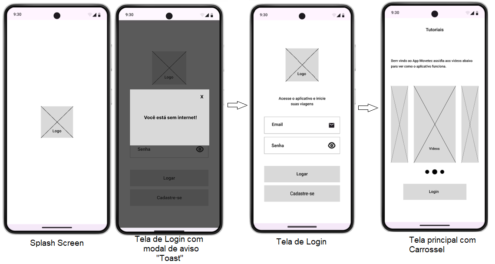
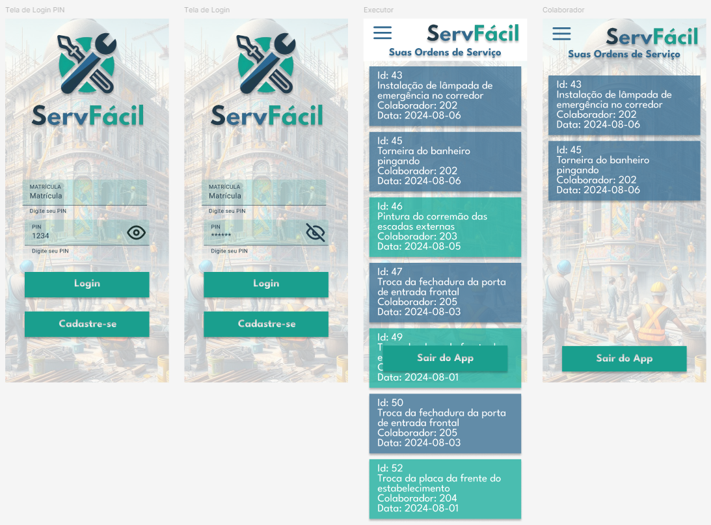
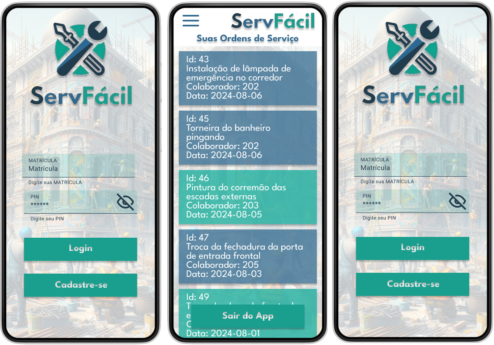

# Aula02 - TAP e Prototipação com Figma

## [TAP (Termo de Abertura do Projeto)](./termo_abertura.md)
O TAP é um documento que descreve o projeto, e é aprovado pelo cliente e pela equipe do projeto. O TAP é um documento que descreve o projeto, e é aprovado pelo cliente e pela equipe do projeto. O TAP é um documento que descreve o projeto, e é aprovado pelo cliente e pela equipe do projeto. O TAP é um documento que descreve o projeto, e é aprovado pelo cliente e pela equipe do projeto. O TAP é um documento que descreve o projeto, e é aprovado pelo cliente e pela equipe do projeto. O TAP é um documento que descreve o projeto, e é aprovado pelo cliente e pela equipe do projeto. O TAP é um documento que descreve o projeto, e é aprovado pelo cliente e pela equipe do projeto. O TAP é um documento que descreve o projeto, e é aprovado pelo cliente e pela equipe do projeto.

## O que é um protótipo?
Normalmente no início de um projeto, caso este seja um produto, podemos criar um protótipo para que possamos visualizar como será o produto final.
Também para demonstrar para o cliente como será o produto final, e assim, o cliente poderá fazer alterações antes do produto ser desenvolvido.

## Ferramentas de Prototipação
- Figma
- Adobe XD
- Sketch
- InVision

## [Figma](https://www.figma.com/)
O Figma é uma ferramenta de design de interface do usuário baseada em navegador, que oferece a possibilidade de colaboração em tempo real.

## Princípios do projeto de um protótipo
- Gerar uma **identidade visual** caso a empresa não possua
    - Paleta de cores
    - Tipografia (Fontes)
    - Logotipo
    - Logomarca

- Ferramentas que auxiliam na geração da identidade visual
    - [Coolors](https://coolors.co/)
    - [Google Fonts](https://fonts.google.com/)
    - [LogoMakr](https://logomakr.com/)
    - [LogoTypeMaker](https://logotypemaker.com/)
    - [Canva](https://www.canva.com/)
    - [Bing Ia](https://www.bing.com/chat)
    - [Gimp](https://www.gimp.org/)
- Criar um **Wireframe**
    - Estrutura do projeto
    - Organização dos elementos
    - Fluxo de navegação

- Aplicar a **identidade visual** no **Wireframe**

- Criar o **Protótipo**
    - Interatividade
    - Fluxo de navegação
    - Testar o protótipo

## Prática
Nesta aula vamos criar o protótipo do aplicativo mobile do projeto OS (Ordens de Serviço) que estamos desenvondo como exemplo.

## Pré Projeto
Projeto fullstack + mobile com prazo de 1,5 meses. Entrega em 19,20 de Setembro de 2024.
### Grupos
- Mínimo 2 pessoas, e maximo 4 pessoas
### Temas sugeridos
- Coleta Seletiva (Aplicativo para coleta seletiva)
- Logística, gestão de frota de veículos, rotas, motoristas
- E-commerce (Aplicativo de vendas, loja virtual e ou real)
- Trânsito (Alertas de trânsito, radares, acidentes)
- Saúde (Aplicativo de saúde, consultas, exames, medicamentos)
- Outros (Temas que o grupo ja possua conhecimento)
- Proibições: Tema com atividades ilícitas ou +18

## Atividade inicial
Montar o grupo, escolher o tema, criar o TAP e o Protótipo do projeto / pelo menos o wireframe.
- [Link do Formulário do Termo de Abertura](https://docs.google.com/forms/d/e/1FAIpQLScbZSLgh22Zj8rhS9_by_9_0HzmbsG6MxcHlfmlphHFdqo52w/viewform?usp=sf_link)