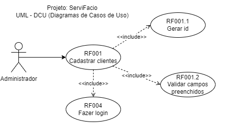
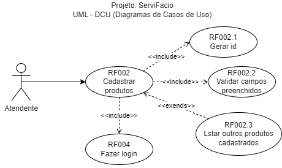
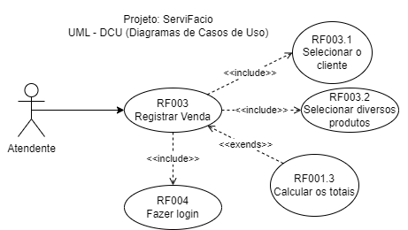

# Aula04 - EAP - Estrutura Analítica do Projeto

- Análise de Riscos
- **Escopo do projeto**
- **Cronograma - Gráfico GANTT**
    - PERT, CPM
- **Custos - Orçamento do Projeto**

## Escopo do projeto
O escopo do projeto é a definição do que será feito no projeto, ou seja, é a **descrição detalhada do que será entregue ao final do projeto**. O escopo do projeto deve ser claro, objetivo e bem definido, para que todos os envolvidos no projeto saibam exatamente o que será feito e o que será entregue.  Para auxiliar a definição do escopo do projeto, é importante criar um **documento de requisitos**, que é um documento que descreve as necessidades e expectativas do cliente em relação ao projeto. O documento de requisitos deve conter informações como:
- Regras de negócio
- Requisitos funcionais
- Requisitos não funcionais

### Exemplo de Documento de Requisitos
- **Regras de negócio**
    - [RN001] O sistema deve permitir o cadastro de clientes com nome, CPF e endereço
    - [RN002] O sistema deve permitir o cadastro de produtos com nome, preço e quantidade em estoque
    - [RN003] O sistema deve permitir a realização de vendas com a seleção de produtos e clientes
    - [RN004] Para fazer qualquer cadastro, o usuário deve estar logado no sistema
    - [RN005] O sistema deve permitir a visualização de relatórios de vendas
    - [RN006] O sistema deve ser Web Full-Stack e implantado em pelo menos dois servidores para aumentar a segurança.
    - [RN007] O sistema deve ser responsivo possuir uma versão mobile.
- **Requisitos funcionais**
    - [RF001] Tela de cadastro de clientes 
        - Prioridade: [X]Essencial, [ ]Importante, [ ]Desejável
        - Referência: [RN001], [RN004]
    - [RF002] Tela de o cadastro de produtos 
        - Prioridade: [X]Essencial, [ ]Importante, [ ]Desejável
        - Referência: [RN002], [RN004]
    - [RF003] Tela de registro de vendas de vendas 
        - Prioridade: [ ]Essencial, [X]Importante, [ ]Desejável
        - Referência: [RN003], [RN004]
- **Requisitos não funcionais**
    - [NF001] O back-end deve ser desenvolvido em NodeJS
        - Referência: [RN006]
    - [NF002] O front-end deve ser desenvolvido em React
        - Referência: [RN006]
    - [NF003] O sistema deve ser responsivo
        - Referência: [RN006]
    - [NF004] A versão mobile deve ser desenvolvida em React Native.
        - Referência: [RN007]

Para ilustrar cada requisito funcional é possível a utilização de **wireframes**, **protótipos**, **fluxogramas** ou **diagramas de caso de uso**. Em nosso projeto, utilizamos diagramas de caso de uso e protótipos.  

## Cronograma
Um cronograma é uma ferramenta de gestão de projetos que visa organizar e distribuir as atividades necessárias para a realização de um projeto. Ele é composto por uma lista de atividades, prazos e responsáveis, e serve para garantir que o projeto seja concluído dentro do prazo estabelecido.  Normalmente um cronograma é representado por um gráfico de Gantt.

## Exemplo de Cronograma - Gráfico GANTT

## Ferramentas de Cronograma
- MS Excel
- MS Project
- [App do Professor](https://wellifabio.github.io/gantt/)
- [Teamgant](https://www.teamgantt.com/)
- [Ganttproject](https://www.ganttproject.biz/)

## PERT, CPM
A análise PERT x CPM auxilia a criação do cronograma do projeto.

- **PERT** (Program Evaluation and Review Technique) é uma técnica utilizada para estimar o tempo necessário para a conclusão de um projeto.

- **CPM** (Critical Path Method) é uma técnica utilizada para identificar o caminho crítico de um projeto, ou seja, a sequência de atividades que determina a duração total do projeto.

### Caminho:

### Caminho crítico:

### Gráfico de Gantt (Cronograma)

## Custos - Orçamento do Projeto
- Após ou durante o desenvolvimento do **cronograma**, é importante fazer o orçamento do projeto.
- Os orçamentos devem ser atualizados conforme o projeto avança.

## Exemplo de orçamento de um projeto Web Fullstack

|Recurso|Hora|Valor Hora|Total|
|-|-|-|-|
|Design - Identidade visual, protótipo|20|30,00|600,00|
|Back-End + Banco de dados|40|30,00|1200,00|
|Front-End|80|30,00|1200,00|
|Mobile|100|30,00|3000,00|
|Integração Full-Stack|40|30,00|1200,00|
|Documentação do Projeto|20|30,00|600,00|
|Testes|20|30,00|600,00|
|Total|||8400,00|

## Atividade - Pré-Projeto TAP e Protótipo
- Conclui a criação do **[TAP](../aula02/TAP.md)** e o **[Protótipo](../aula02)** do projeto / pelo menos o wireframe.

#### [Formulário de entrega do TAP e Protótipo](https://docs.google.com/forms/d/e/1FAIpQLScbZSLgh22Zj8rhS9_by_9_0HzmbsG6MxcHlfmlphHFdqo52w/viewform?usp=sf_link) - Como entregar:
- **TAP** em PDF (Utilize o MS Word e imprima em PDF)
- **Protótipo** em repositório **github público** do projeto contendo uma pasta ./docs e dentro dela:
    - O TAP em PDF,
    - um README.md com os wireframes, identidade visual, link do figma,
    - O arquivo  do protótipo  funcional Figma

## Atividade - Projeto EAP
- Concluir análise de viabilidade utilizando a matriz SWOT do seu projeto
- Definir o Escopo do Projeto
    - Listar as regras de negócio
    - Definir os requisitos funcionais e não funcionais
- Traçar o caminho crítico do projeto
- Criar um cronograma do projeto

## Entrega do Pré-Projeto
- 19,20 de Setembro de 2024.