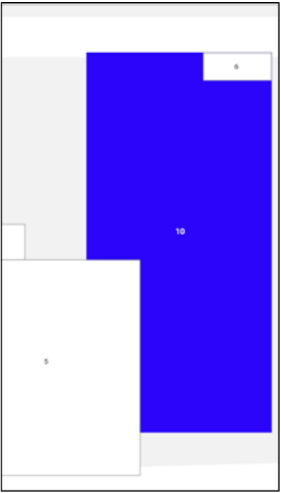

# Aula08 - Situação de Aprendizagem - Fábrica de automóveis

## Contextualização
O mercado automotivo está em constante mudança e as fábricas que conseguem dinamizar seu processo logístico tendem a alcançar uma vantagem competitiva em relação às outras e, consequentemente, conseguem produzir mais automóveis realizando mais vendas.

## Desafio
Para ajudar a solucionar esse problema, você deverá criar um sistema desktop ou web do pátio de automóveis de uma fábrica, onde os funcionários poderão clicar em uma área e visualizar os automóveis que estão atualmente alocados para ela. Também deve ser possível, através desse sistema, vender automóveis de uma área qualquer do pátio.  Abaixo você verá detalhadamente as entregas que deverão ser efetuadas e quais requisitos elas deverão cumprir.

## Entregas
Ao final desse projeto você terá que entregar:
|Nº|Nome da Entrega|Descrição|Tempo minutos|
|:-:|-|-|:-:|
|1|Diagrama Entidade-Relacionamento (DER)|Criação de um diagrama entidade-relacionamento de banco de dados que represente o cenário proposto acima.|15|
|2|Banco de dados e importação de dados|Criação do banco e importação dos dados presentes nos alocacao.csv, automoveis.csv, clientes.csv e concessionarias.csv para alimentar as principais tabelas que o banco de dados deve possuir.|35|
|3|Caso de uso do cenário de venda de automóvel|Criação de um diagrama de caso de  uso que ilustre o cenário de venda de automóvel.|20|
|4|Tela inicial pátio de automóveis|Criação de uma tela que apresentará a planta do pátio de automóveis com suas respectivas áreas.|40|
|5|Tela com detalhes de uma área|Criação de uma tela que permita ao usuário visualizar os automóveis alocados para uma determinada área.|30|
|6|Tela de venda de automóvel|Criação de uma tela que permita ao usuário vender um automóvel de uma área.|40|
|7|README.md -Instruções de tecnologias utilizadas e execução do projeto|Criação de um arquivo README.md com instruções de como executar o projeto e quais tecnologias foram utilizadas.|10|

### 1. Diagrama Entidade-Relacionamento (DER)
Você deve criar um diagrama entidade-relacionamento que contenha as tabelas, relações, campos e chaves do banco de dados previsto por você para atendimento ao cenário proposto acima. Ao criar seu diagrama, leve também em consideração a base de dados fornecida pelo avaliador. O diagrama criado deve ser exportado em formato *.pdf ou *.png e salvo na pasta ./docs. do seu projeto.

### 2. Banco de dados e importação de dados
Para essa entrega você deve criar toda a estrutura física de banco de dados com suas respectivas tabelas, relacionamentos e consultas/views necessários para atender a proposta do cenário acima. O banco de dados criado deve considerar a estrutura projetada no diagrama entidade x relacionamento construído por você. Importe os dados presentes nos arquivos alocacao.csv, automoveis.csv, clientes.csv e
concessionarias.csv para tabelas equivalentes do banco de dados criado por você. Atente que esses arquivos de dados já possuem normalização e você deve replicar essa mesma normalização no banco. O script de importação dos dados para o banco de dados deve estar em formato *.sql e salvo na pasta ./docs. Ou caso utilize um ORM (Object Relational Mapping) como **prisma**, sequelize, JPA, etc, o sistema de importação de dados pode ser SQL ou programado "tipo seed" porém deve ser documentado no README.md.

### 3. Caso de uso do cenário de venda de automóvel
Diante do cenário apresentado, você deve criar um caso de uso que ilustre os atores, objetos e ações envolvidos no fluxo de venda de um automóvel.  Para isso, você deve também levar em consideração as regras de negócio detalhadas nas próximas
seções desse documento. Seu diagrama de caso de uso deve ser exportado em formato *.pdf ou *.png e salvo na pasta ./docs. do seu projeto.

### 4. Tela inicial pátio de automóveis
Para atender ao cenário apresentado, você deve implementar uma tela inicial que conterá as mesmas áreas indicadas no arquivo “planta 1.png” entregue a você. Essa será a primeira tela exibida para o usuário quando ele executar/acessar seu sistema.
 A imagem a seguir ilustra um exemplo de como essa tela poderia ser implementada:
  
Atente que essa imagem é uma representação do layout entregue no arquivo "planta.png". Você deve reproduzir na sua aplicação as posições e numerações das áreas indicadas nesse arquivo (“./wireframe/planta 1.png”). As seguintes regras de negócio devem ser implementadas nessa tela: 
- 1 Cada região da planta sendo visualizada pelo usuário deve apresentar, além do número que representa a região, uma cor que indique a ocupação que aquela região possui.
    - 1.1 Branco (#FFFFFF): indica que aquela área está sem automóveis alocados para ela, ou seja, está com 0 ocupação (vazia).
    - 1.2 Azul (#0000FF): indica que aquela área está com automóveis alocados para ela, ou seja, está com ocupação diferente de 0.
    - 1.3 A imagem abaixo mostra um exemplo onde a área 10 está com veículos alocados, porém as áreas 5 e 6 não está:
  

### 5. Tela com detalhes de uma área
Sempre que o usuário clicar em uma área que possua automóveis, então deve ser exibido para ele uma tela com as informações dos automóveis que se encontram naquela área. A imagem a seguir ilustra um exemplo de como essa tela poderia ser implementada:  
Atente que essa imagem é apenas um exemplo, sinta-se livre para criar seu próprio layout contanto que as seguintes regras de negócio estejam presentes:
- 1 Essa tela deve apresentar como título a identificação da área que está sendo visualizada pelo usuário. No exemplo da imagem acima, o título é “Área 10” porque essa é a área que está com seus detalhes sendo visualizados pelo usuário.
- 2 Essa tela deve exibir os dados dos automóveis que se encontram na área que foi clicada pelo usuário. Para cada automóvel listado, os dados devem ser:
    - Modelo do automóvel.
    - Preço do automóvel.
- 3 Cada automóvel listado deve possuir um botão “Vender” (ou recurso semelhante) associado a ele que ao ser clicado direcionará o usuário para a tela de venda de automóvel, descrita na próxima seção.
- 4 Caso a quantidade de um automóvel para essa área seja igual a 0 na base de dados, então esse automóvel não deverá ser exibido na listagem dessa tela.
- 5 Essa tela só aparece quando o usuário clica em uma área que possui automóveis, então se o usuário clicar em uma área que não contém automóveis uma mensagem deve ser exibida informando que a área clicada está vazia e a tela com detalhes de uma área não deve ser exibida.

### 6. Tela de venda de automóvel
Caso o usuário clique no botão “Vender” (ou recurso semelhante implementado por você) de algum automóvel exibido na tela com detalhes de uma área, então deve ser exibido para ele uma tela que permita que seja realizada a venda do automóvel. 
A imagem a seguir ilustra um exemplo de como essa tela poderia ser implementado:
  
Atente que essa imagem é apenas um exemplo, sinta-se livre para criar seu próprio layout contanto que as seguintes regras de negócio estejam presentes:
- 1 Essa tela deve apresentar como título o modelo do automóvel que está sendo vendido.
- 2 Essa tela deve possuir os campos:
    - 2.1 Cliente: esse select deve listar o nome de todos os clientes presentes na base de dados.
    - 2.2 Concessionária: esse select deve listar somente as concessionárias que possuem o automóvel que está sendo vendido na área que o usuário clicou previamente. Por exemplo, se as concessionárias A, B e C possuem o modelo XYZ na área 10, então essas 3 áreas aparecerão no select para escolha.
- 3 O botão “Confirmar” só deve ficar habilitado quando todos os campos forem preenchidos pelo usuário.
- 3.1 Quando o usuário clicar nesse botão, então a venda do automóvel deve ser efetuada e as informações de estoque do automóvel deve ser atualizada no banco de dados decrementando em 1 o valor previamente existente.

## Formato de entrega
O projeto deve ser entregue em um repositorio público git, com a seguinte estrutura de pastas:
- ./docs: contendo os arquivos de documentação solicitados.
- ./api: contendo o código fonte do backend do projeto.
- ./web: contendo o código fonte do frontend do projeto.
O link do repositório deve ser enviado para este **[FORM - PROJETO - FABICA - AUTOMÓVEIS](https://forms.gle/RzjqXzqZ3STjGv5K6).**

## Orientações Gerais
**Atenção**: Mesmo que as telas e popups / modais acima apresentem um fluxo de exibição, caso você não tenha conseguido desenvolver algum deles, procure colocar um recurso (botão, link etc.) que permita acessar as outras telas / modais / poupus que você criou. Por exemplo: se você não criou a tela de áreas, coloque algum recurso que permita o acesso à tela / popup / modal "tela com detalhes de uma área".
- No desenvolvimento dessa prova você deve considerar os seguintes padrões:
- Para todos os textos a fonte que você deverá utilizar é **Segoe UI**.
- As cores que podem ser utilizadas no desenvolvimento das suas telas são:

|RGB|HEXADECIMAL|
|-|-|
|255, 255, 255|#FFFFFF|
|120, 20, 255|#7814FF||
|112, 112, 112|#707070|
|0, 0, 0|#000000|

O avaliador entregará o arquivo da planta que você deve reproduzir, e os arquivos com os dados a serem importados para a base de dados que você precisará construir.

## [Avaliação](./avaliacao.md)

