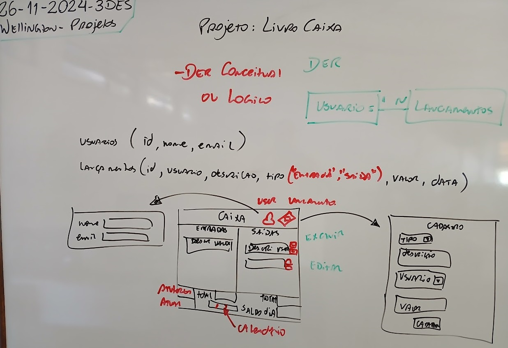
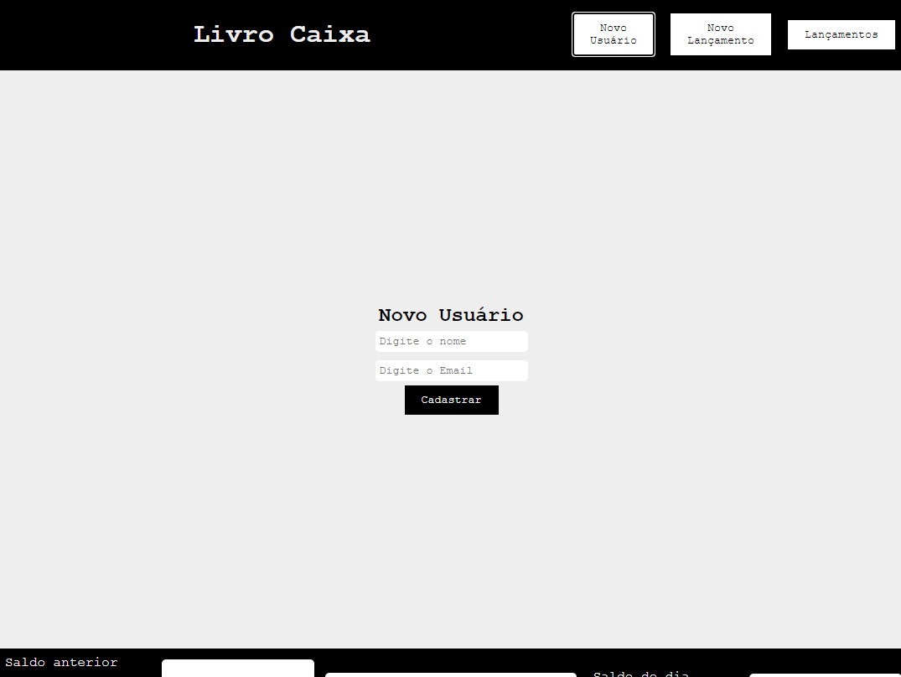
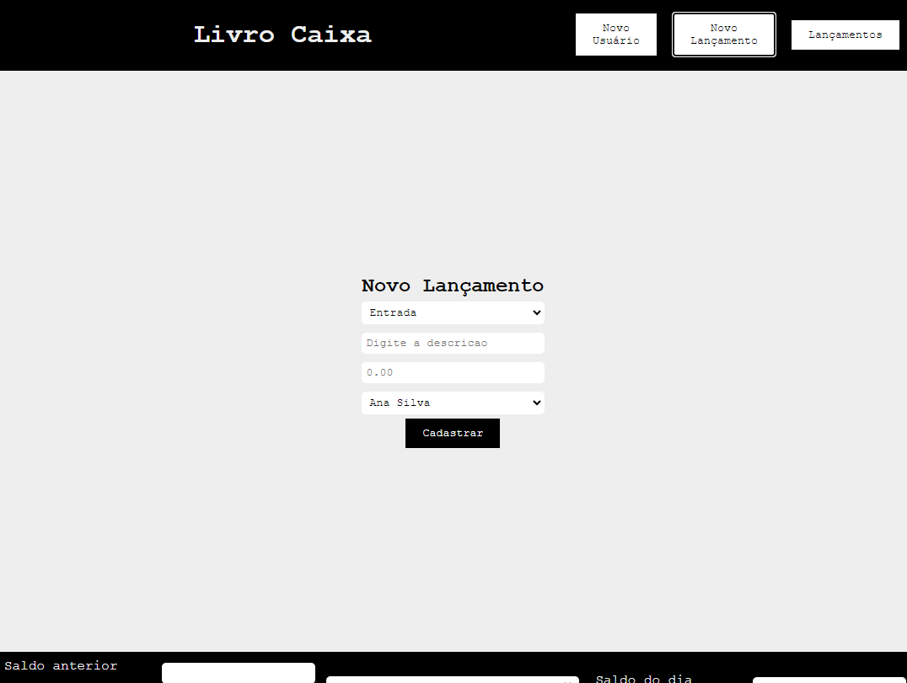
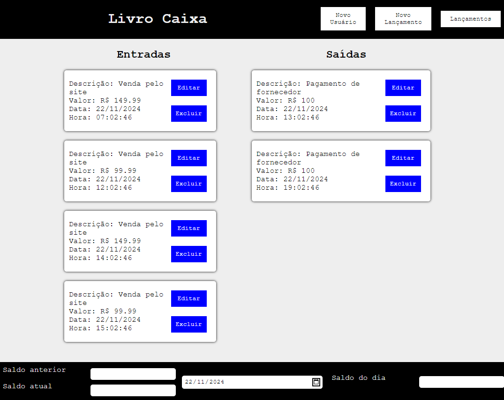
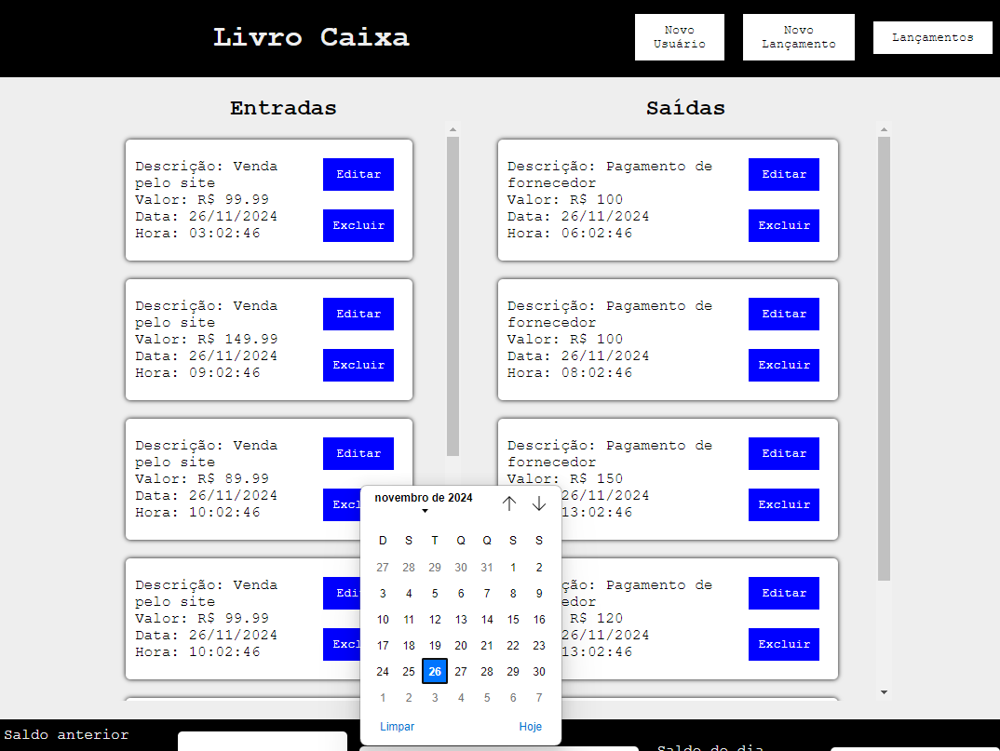
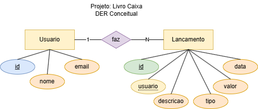
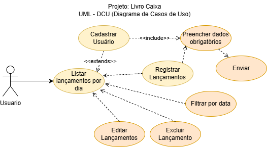

# Aula11 - Situação Problema: Livro Caixa
## Treinamento para o SAEP Prático

## Contextualização
Todos os tipos de negócio que trabalham com fluxo de caixa necessitam de um sistema para registras as movimentações diárias. O livro caixa é um dos métodos mais antigos e ainda muito utilizado para esse fim. O livro caixa é um registro de todas as movimentações financeiras de uma empresa, seja ela uma microempresa, empresa de pequeno porte ou uma grande empresa. O livro caixa é um documento obrigatório para a contabilidade de uma empresa, pois é nele que são registradas todas as entradas e saídas de dinheiro.

## Desafio
Desenvolver um sistema que simule um livro caixa, onde o usuário poderá registrar as movimentações financeiras diárias de uma empresa. O sistema deverá permitir o registro de entradas e saídas de dinheiro, bem como a consulta do saldo atual da empresa.<br>As regras de negócio são:
- Os dados do usuário são: id (numérico e incrementado automaticamente), nome completo e email (verificar se possui @ no campo para ser e-mail), totos os dados são obrigatórios
- Os dados dos lançamentos são:  id (numérico e incrementado automaticamente), descrição (texto), valor (monetário), usuário (referencia o usuário que fez o lançamento), tipo ("Entrada","Saída"), Data (Data e hora do lançamento)
- O sistema deve permitir:
    - Criar usuários (Apenas criar e listar, não é necessário excluir ou alterar)
    - Criar lançamentos
    - Gerenciar lançamentos (Listar separados por tipo [Entrada e Saída]), Editar, Excluir e separados por Data.
    - Calcular totais (entrada e saída) e saldos (anterior, atual e do dia)


## Entregas
|Entrega|Descrição|
|-|-|
|DER Conceitual|Diagrama de Entidade Relacionamento do sistema|
|UML - DCU|Diagrama de Caso de Uso do sistema|
|Cadastro de usuários|Tela de cadastro de usuários do sistema|
|Cadastro de Lançamentos|Tela de cadastro de lançamentos financeiros|
|Tela principal|Tela principal do sistema com os lançamentos do dia, um filtro para escolher a data e as informações dos saldos|

## Wireframes
- Tela de cadastro de usuários

- Tela de cadastro de lançamentos

- Tela principal

- Tela principal com filtro de data

## Identidade visual
- Fonte: Courier New
- Paleta de cores:

|Código Hexadecimal|Cor|
|-|-|
|#000000|Preto|
|#eeeeee|Cinza Claro|
|#FFFFFF|Branco|
|#FF0000|Vermelho|
|#0000FF|Azul|

## Dicas de como executar o projeto:
- 1 Criar uma pasta e suas subpastas conforme a estrutura do projeto
```bash
./livrocaixa
./livrocaixa/api
./livrocaixa/web
./livrocaixa/docs
```
- 2 Criar os diagramas de entidade relacionamento e de caso de uso


- 3 Inicar o Back-end NodeJS com Prisma
- 3.1 Abra a pasta **./livrocaixa** com VsCode e abra um terminal **cmd** ou **bash** CTRL + ", acesse a pasta **api**, instale o prisma globalmente, inicie o projeto e a biblioteca prisma para MySQL.
```bash
cd api
npm i -g prisma
prisma init --datasource-provider mysql
```
- 3.2 Configure o arquivo **.env** com as informações do banco de dados
```env
DATABASE_URL="mysql://root@localhost:3306/livrocaixa?schema=public&timezone=utc"
```
- 3.3 Abra o XAMPP e inicie o MySQL
- 3.4 Edite o arquivo **schema.prisma** e adicione o modelo de dados
```prisma
generator client {
  provider = "prisma-client-js"
}

datasource db {
  provider = "mysql"
  url      = env("DATABASE_URL")
}

model Usuario{
  id Int @id @default(autoincrement())
  nome String @db.VarChar(100)
  email String @db.VarChar(255) @unique
  lancamentos Lancamento[]
}

model Lancamento{
  id Int @id @default(autoincrement())
  usuario Int
  descricao String @db.Text
  valor Float
  tipo Tipo @default(entrada)
  data DateTime @db.DateTime @default(now())
  user Usuario @relation(fields: [usuario], references: [id])
}

enum Tipo {
  entrada
  saida
}
```
- 3.5 Crie o arquivo server.js e adicione o código
```js
const express = require('express');
const cors = require('cors');
const app = express();

const routes = require('./routes');

app.use(express.json());
app.use(cors());
app.use('/', routes);

app.listen(4000, () => {
    console.log('API Livro Caixa respondendo em http://localhost:4000');
});
```
- 3.6 Execute os comandos para criar o projeto e o banco de dados
```bash
npm init -y
npm i prisma --save-dev
npm i express cors dotenv
npx prisma migrate dev --name init
```
- 3.7 Crie o arquivo **src/routes.js** e adicione o código
```js
const express = require('express');
const router = express.Router();

const Usuario = require('./controllers/usuario');
const Lancamento = require('./controllers/lancamento');

router.get('/', (req, res) => {
    res.send('API Livro Caixa Respondendo');
});

router.post('/usuarios', Usuario.create);
router.get('/usuarios', Usuario.read);

router.post('/lancamentos', Lancamento.create);
router.get('/lancamentos', Lancamento.read);
router.get('/lancamentos/:dia', Lancamento.readDia);
router.put('/lancamentos', Lancamento.update);
router.delete('/lancamentos/:id', Lancamento.del);

module.exports = router;
```

- 3.8 Crie a pasta **src/controllers** e os arquivos **usuario.js** e **lancamento.js** e adicione o código a seguir no arquivo **usuario.js**
```js
const { PrismaClient } = require('@prisma/client');
const prisma = new PrismaClient();

const create = async (req, res) => {
    const usuario = await prisma.usuario.create({
        data: req.body
    });
    res.status(201).json(usuario);
}

const read = async (req, res) => {
    const usuarios = await prisma.usuario.findMany();
    res.json(usuarios);
}

module.exports = { create, read };
```
- 3.9 Adicione o código a seguir no arquivo **lancamento.js**
```js
const { PrismaClient } = require('@prisma/client');
const prisma = new PrismaClient();

const create = async (req, res) => {
    const lancamento = await prisma.lancamento.create({
        data: req.body
    });
    res.status(201).json(lancamento);
}

const read = async (req, res) => {
    const lancamentos = await prisma.lancamento.findMany();
    res.json(lancamentos);
}

const readDia = async (req, res) => {
    const inicio = new Date(req.params.dia);
    inicio.setHours(0, 0, 0, 0);
    inicio.setDate(inicio.getDate() + 1);
    const fim = new Date(req.params.dia);
    fim.setHours(23, 59, 59, 999);
    fim.setDate(fim.getDate() + 1);
    const lancamentos = await prisma.lancamento.findMany({
        where: {
            data: {
                gte: inicio,
                lt: fim
            }
        }
    });
    res.json(lancamentos);
}

const update = async (req, res) => {
    const lancamento = await prisma.lancamento.update({
        where: {
            id: req.body.id
        },
        data: req.body
    });
    res.json(lancamento);
}

const del = async (req, res) => {
    const lancamento = await prisma.lancamento.delete({
        where: {
            id: parseInt(req.params.id)
        }
    });
    res.json(lancamento);
}

module.exports = { create, read, readDia, update, del };
```
- 3.10 Execute o projeto
```bash
node server.js
#ou
npx nodemon
```
- 4 Iniciar o Front-end com Vanilla JS
- 4.1 Crie os arquivos **index.html**, **style.css** e **script.js** na pasta **web**
- 4.2 Adicione o código a seguir no arquivo **index.html**
```html
<!DOCTYPE html>
<html lang="en">

<head>
    <meta charset="UTF-8">
    <meta name="viewport" content="width=device-width, initial-scale=1.0">
    <link rel="stylesheet" href="style.css">
    <title>Livro Caixa</title>
</head>

<body onload="listarLancamentos()">
    <header>
        <h1>Livro Caixa</h1>
        <nav>
            <button onclick="novoUsuario()">Novo Usuário</button>
            <button onclick="novoLancamento()">Novo Lançamento</button>
            <button onclick="window.location.reload()">Lançamentos</button>
        </nav>
    </header>
    <main id="conteiner">
        <table>
            <thead>
                <tr>
                    <th><h2>Entradas</h2></th>
                    <th><h2>Saídas</h2></th>
                </tr>
            </thead>
            <tbody>
                <tr>
                    <td><div id="entradas"></div></td>
                    <td><div id="saidas"></div></td>
                </tr>
            </tbody>
            <tfoot>
                <tr>
                    <td id="totEntradas"></td>
                    <td id="totSaidas"></td>
                </tr>
            </tfoot>
        </table>
    </main>
    <footer>
        <div class="saldos">
            <label for="santerior">Saldo anterior</label>
            <input type="number" id="santerior" step="0.01" readonly>
            <label for="satual">Saldo atual</label>
            <input type="number" id="satual"  step="0.01" readonly>
        </div>
        <input type="date" name="data" id="data" onchange="listarLancamentos(this.value)">
        <div class="saldos">
            <label for="sdia">Saldo do dia</label>
            <input type="number" id="sdia"  step="0.01" readonly>
        </div>
    </footer>
</body>
<script src="script.js"></script>

</html>
```
- 4.3 Adicione o código a seguir no arquivo **style.css**
```css
* {
    margin: 0;
    padding: 0;
    box-sizing: border-box;
    font-family: 'Courier New', Courier, monospace;
    text-decoration: none;
}

:root {
    --cor1: #000000;
    --cor2: #eeeeee;
    --cor3: #ffffff;
    --cor4: #ff0000;
    --cor5: #0000ff;
}

body {
    width: 100vw;
    height: 100vh;
    background-color: var(--cor2);
    color: var(--cor1);
    display: flex;
    flex-direction: column;
    align-items: center;
    justify-content: space-between;
}

header,
footer {
    width: 100%;
    display: flex;
    justify-content: space-around;
    align-items: center;
    background-color: var(--cor1);
    color: var(--cor2);
    min-height: 10vh;
}

nav {
    display: flex;
    justify-content: center;
    align-items: center;
    width: 50%;
}

h1 {
    width: 100%;
    text-align: center;
}

nav button {
    background-color: var(--cor3);
    color: var(--cor1);
    border: none;
    padding: 10px 20px;
    margin: 0 10px;
    cursor: pointer;
}

nav button:hover {
    background-color: var(--cor1);
    color: var(--cor3);
    box-shadow: 0 0 5px var(--cor3);
}

main {
    width: 100%;
    display: flex;
    flex-direction: column;
    align-items: center;
    justify-content: center;
    min-height: 80vh;
}

table {
    width: 80%;
    height: 100%;
    border-collapse: collapse;
    margin: 20px 0;
}

tfoot td{
    max-height: 5vh;
}

input,
select {
    width: 100%;
    max-width: 300px;
    padding: 5px;
    margin: 5px;
    border: none;
    border-radius: 5px;
}

.saldos {
    width: fit-content;
    display: grid;
    grid-template-columns: 1fr 1fr;
    margin: 20px 0;
}

form {
    display: flex;
    flex-direction: column;
    align-items: center;
    justify-content: center;
}

form button {
    background-color: var(--cor1);
    color: var(--cor3);
    border: none;
    padding: 10px 20px;
    margin: 0 10px;
    cursor: pointer;
}

#entradas,
#saidas {
    height: 100%;
    max-height: 65vh;
    display: flex;
    flex-direction: column;
    align-items: baseline;
    justify-content: flex-start;
    margin: 10px;
    padding: 10px;
    overflow-y: auto;
    overflow-x: hidden;
}

.card {
    width: 90%;
    display: flex;
    align-items: center;
    justify-content: space-between;
    margin: 10px;
    padding: 10px;
    border-radius: 5px;
    background-color: var(--cor3);
    color: var(--cor1);
    box-shadow: 0 0 5px var(--cor1);
}

.areas {
    width: fit-content;
    display: flex;
    flex-direction: column;
    align-items: left;
    justify-content: space-around;
}

.areas button {
    background-color: var(--cor5);
    color: var(--cor3);
    border: none;
    padding: 10px;
    margin: 10px;
    cursor: pointer;
}

.areas button:hover {
    background-color: var(--cor4);
    color: var(--cor3);
    box-shadow: 0 0 5px var(--cor4);
}
```
- 4.4 Adicione o código a seguir no arquivo **script.js**
```js
const uri = "http://localhost:4000/";

const conteiner = document.getElementById("conteiner");
const entradas = document.getElementById("entradas");
const saidas = document.getElementById("saidas");
const totEntradas = document.getElementById("totEntradas");
const totSaidas = document.getElementById("totSaidas");
const satual = document.getElementById("satual");
const santerior = document.getElementById("santerior");
const sdia = document.getElementById("sdia");
const data = document.getElementById("data");
var usuarios = [];
var lancamentos = [];

//Listar os usuários
fetch(uri + "usuarios")
    .then((resp) => resp.json())
    .then((resp) => {
        usuarios = resp;
    });

//Listar os lançamentos
fetch(uri + "lancamentos")
    .then((resp) => resp.json())
    .then((resp) => {
        lancamentos = resp;
    });

//Cadastrar os usuários (Tela01)
function novoUsuario() {
    conteiner.innerHTML = `
    <form id="novoUsuario">
        <h2>Novo Usuário</h2>
        <input type="text" name="nome" placeholder="Digite o nome" required>
        <input type="email" name="email" placeholder="Digite o Email" required>
        <button type="submit">Cadastrar</button>
    </form>`;
    const novoUsuario = document.getElementById("novoUsuario");
    novoUsuario.addEventListener("submit", (e) => {
        e.preventDefault();
        const dados = {
            nome: novoUsuario.nome.value,
            email: novoUsuario.email.value,
        };
        fetch(uri + "usuarios", {
            method: "POST",
            headers: {
                "Content-Type": "application/json",
            },
            body: JSON.stringify(dados),
        })
            .then((resp) => resp.status)
            .then((status) => {
                if (status === 201) {
                    alert("Usuário cadastrado com sucesso!");
                    window.location.reload();
                } else {
                    alert("Erro ao cadastrar usuário!");
                }
            });
    });
}

//Cadastrar os lançamentos (Tela02)
function novoLancamento() {
    conteiner.innerHTML = `
    <form id="novoLancamento">
        <h2>Novo Lançamento</h2>
        <select name="tipo">
            <option value="entrada">Entrada</option>
            <option value="saida">Saída</option>
        </select>
        <input type="text" name="descricao" placeholder="Digite a descricao" required>
        <input type="number" step="0.01" name="valor" placeholder="0.00" required>
        <select name="usuario">
            ${usuarios.map(usuario => `<option value="${usuario.id}">${usuario.nome}</option>`)}
        </select>
        <button type="submit">Cadastrar</button>
    </form>`;
    const novoLancamento = document.getElementById("novoLancamento");
    novoLancamento.addEventListener("submit", (e) => {
        e.preventDefault();
        const dados = {
            usuario: Number(novoLancamento.usuario.value),
            descricao: novoLancamento.descricao.value,
            tipo: novoLancamento.tipo.value,
            valor: Number(novoLancamento.valor.value),
        };
        fetch(uri + "lancamentos", {
            method: "POST",
            headers: {
                "Content-Type": "application/json",
            },
            body: JSON.stringify(dados),
        })
            .then((resp) => resp.status)
            .then((status) => {
                if (status === 201) {
                    alert("Lançamento cadastrado com sucesso!");
                    window.location.reload();
                } else {
                    alert("Erro ao cadastrar lançamento!");
                }
            });
    });
}

//Listar os lançamentos da data (Tela03)
async function listarLancamentos(data) {
    entradas.innerHTML = "";
    saidas.innerHTML = "";
    let totalEntradas = 0;
    let totalSaidas = 0;
    let saldoDia = 0;
    let saldoAtual = 0;
    let saldoAnterior = 0;
    if (data == undefined) data = new Date().toISOString().split("T")[0];
    await fetch(uri + "lancamentos/" + data)
        .then((resp) => resp.json())
        .then((resp) => {
            resp.forEach(l => {
                if (l.tipo === "entrada") {
                    entradas.innerHTML += `<div class="card">
                    <div class="areas">
                        <p>Usuário: ${usuarios.find(u => u.id === l.usuario).nome}</p>
                        <p>Descrição: ${l.descricao}</p>
                        <p>Data: ${new Date(l.data).toLocaleDateString("pt-BR")}</p> 
                        <p>Hora: ${new Date(l.data).toLocaleTimeString("pt-BR")}</p>
                        <p>Valor: R$ ${l.valor.toFixed(2).replace('.',',')}</p>
                    </div>
                    <div class="areas">
                        <button onclick="editarLancamento(${l.id})">Editar</button>
                        <button class="excluir" onclick="excluirLancamento(${l.id})">Excluir</button>
                    </div>
                    </div>`;
                    totalEntradas += l.valor;
                } else {
                    saidas.innerHTML += `<div class="card">
                    <div class="areas">
                        <p>Usuário: ${usuarios.find(u => u.id === l.usuario).nome}</p>
                        <p>Descrição: ${l.descricao}</p>
                        <p>Data: ${new Date(l.data).toLocaleDateString("pt-BR")}</p> 
                        <p>Hora: ${new Date(l.data).toLocaleTimeString("pt-BR")}</p>
                        <p>Valor: R$ ${l.valor.toFixed(2).replace('.',',')}</p>
                    </div>
                    <div class="areas">
                        <button onclick="editarLancamento(${l.id})">Editar</button>
                        <button class="excluir" onclick="excluirLancamento(${l.id})">Excluir</button>
                    </div>
                    </div>`;
                    totalSaidas += l.valor;
                }
            });
        })
        .then(() => {
            totEntradas.innerHTML = 'Total de entradas: ' + totalEntradas.toFixed(2).replace('.',',');
            totSaidas.innerHTML = 'Total de saídas: ' + totalSaidas.toFixed(2).replace('.',',');
            saldoDia = totalEntradas - totalSaidas;
            sdia.value = saldoDia.toFixed(2);
        }).then(() => {
            for (let i = 0; i < lancamentos.length; i++) {
                if (new Date(lancamentos[i].data) < new Date(data)) {
                    if (lancamentos[i].tipo == "entrada") {
                        saldoAnterior += lancamentos[i].valor;
                    } else {
                        saldoAnterior -= lancamentos[i].valor;
                    }
                }
            }
            santerior.value = saldoAnterior.toFixed(2);
            saldoAtual = saldoAnterior + saldoDia;
            satual.value = saldoAtual.toFixed(2);
        });
}

function excluirLancamento(id) {
    if (confirm(`Confirma a exclusão do lançamento ${id}`)) {
        fetch(uri + "lancamentos/" + id, {
            method: "DELETE",
        })
            .then((resp) => resp.status)
            .then((status) => {
                if (status === 200) {
                    alert("Lançamento excluído com sucesso!");
                    window.location.reload();
                } else {
                    alert("Erro ao excluir lançamento!");
                }
            });
    }
}

function editarLancamento(id){
    const lancamento = lancamentos.find(l => l.id === id);
    console.log(lancamento, id);
    conteiner.innerHTML = `
    <form id="novoLancamento">
        <h2>Editar Lançamento</h2>
        <select name="tipo">
            <option value="entrada" ${lancamento.tipo == 'entrada'?'selected':''}>Entrada</option>
            <option value="saida" ${lancamento.tipo == 'saida'?'selected':''}>Saída</option>
        </select>
        <input type="text" name="descricao" placeholder="Digite a descricao" value="${lancamento.descricao}" required>
        <input type="number" step="0.01" name="valor" placeholder="0.00"  value="${lancamento.valor}" required>
        <select name="usuario">
            ${usuarios.map(usuario => `<option value="${usuario.id}" ${lancamento.usuario == usuario.id?'selected':''}>${usuario.nome}</option>`)}
        </select>
        <button type="submit">Enviar</button>
    </form>`;
    const novoLancamento = document.getElementById("novoLancamento");
    novoLancamento.addEventListener("submit", (e) => {
        e.preventDefault();
        const dados = {
            id: Number(id),
            usuario: Number(novoLancamento.usuario.value),
            descricao: novoLancamento.descricao.value,
            tipo: novoLancamento.tipo.value,
            valor: Number(novoLancamento.valor.value),
        };
        fetch(uri + "lancamentos", {
            method: "PUT",
            headers: {
                "Content-Type": "application/json",
            },
            body: JSON.stringify(dados),
        })
            .then((resp) => resp.status)
            .then((status) => {
                if (status === 200) {
                    alert("Lançamento alterado com sucesso!");
                    window.location.reload();
                } else {
                    alert("Erro ao alterar lançamento!");
                }
            });
    });
}
```
