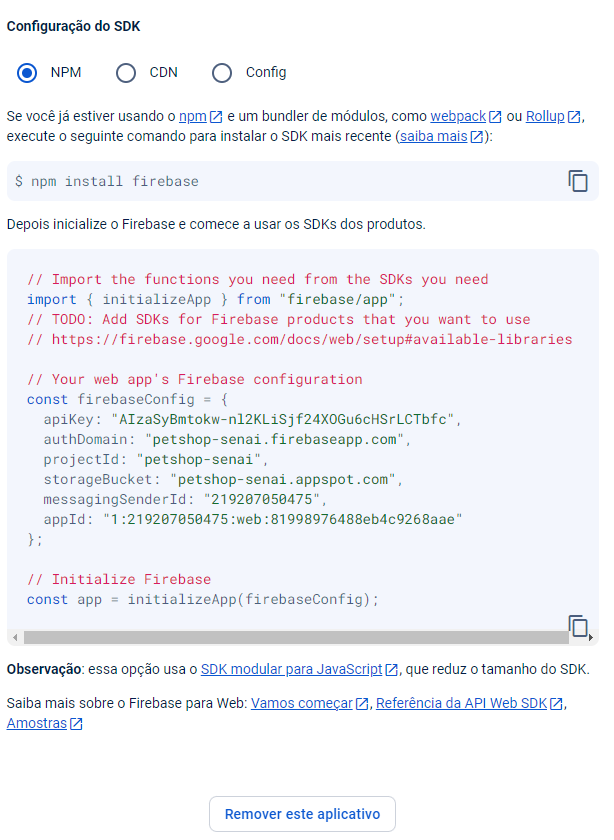
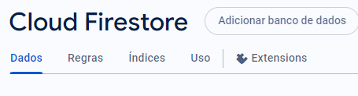

<div align = center>
  
    </div>
    

# Aula 03 - Utilizando Firebase
https://meet.google.com/ibk-cpoi-oja

Vamos criar um projeto para armazenar dados no Firebase.

## Objetivo
- Criar um projeto no Firebase
- Configurar o projeto utilizando Expo

## Criando Projeto no Expo

1. Crie um projeto com o Expo
```bash 
npx create-expo-app petshop --template blank
```
2. Acesse o diretório do projeto
```bash
cd petshop
```
3. Instale o pacote do Firebase
```bash
npm install firebase
```
## Firebase
1. Acesse o site do [Firebase](https://firebase.google.com/)
2. Crie um projeto chamado Petshop

3. Insira o nome do projeto e clique em continuar

4. Neste caso desativo o analytics

5. Ele vai gerar o codigo para consumir o banco no aplicativo

5. Instale o pacote do Firebase no projeto
```bash
npm install firebase
```

Dentro do seu projeto no Firebase clique na opção


Adicione um banco de dados Firestore

dentro desta opção vamos definir as regras de acesso ao banco de dados



Vamos definir a seguinte regra
```javascript
rules_version = '2';
service cloud.firestore {
  match /databases/{database}/documents {
    match /{document=**} {
      allow read, write: if true;
    }
  }
}
```
Com o codigo feito utilizar o comando
```bash 
yarn run web
```

Quando der o erro Metro Builder, executar
```bash
yarn add react-native-web react-dom @expo/metro-runtime
```


