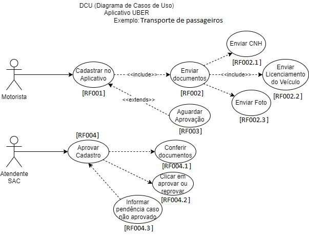
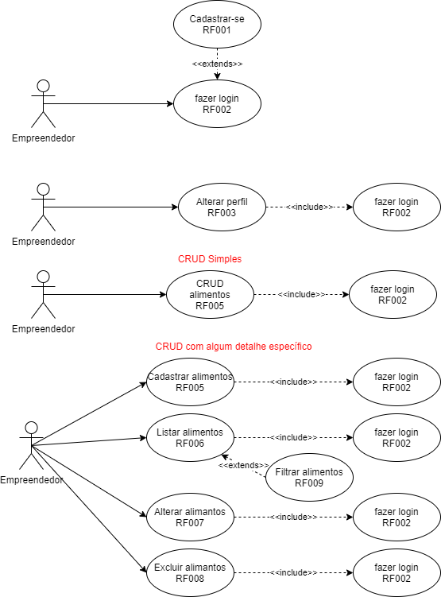

 ### Form Atividade: https://forms.gle/ndHboFZppkyiXnrJ8

# CONHECIMENTOS - Levantamento, Análise e Registros
- 2. Levantamento de Requisitos
	- 2.1.Definição
	- 2.2.Técnicas
		- 2.2.1.Levantamento orientado a pontos de vista
		- 2.2.2.Etnografia (observação)
		- 2.2.3.Método Analítico
		- 2.2.4.Workshops
		- 2.2.5.Prototipagem
		- 2.2.6.Entrevistas
		- 2.2.7.Questionários
		- 2.2.8.Brainstorming
		- 2.2.9.Métodos Sistêmicos (JAD - Joint Application Design)
	- 2.3.Fases
		- 2.3.1.Coleta
		- 2.3.2.Análise
		- 2.3.3.Registros
- 3. Gerenciamento de Requisitos
	- 3.1.Definição
	- 3.2.Gestão de mudanças
	- 3.3.Rastreabilidade de requisitos
	- 3.4.Validação de requisitos
- 4. UML (Unified Modeling Language)
	- 4.1.Definição
	- 4.2.Casos de Uso
		- 4.2.1.Diagrama
		- 4.2.2.Narrativa
## Exemplos de UML - DCU (Diagramas de Casos de Uso)

# Atividade 1:
- Contextualização: Você é um pequeno empresário dono de um dos negócios elencados pelo instrutor, precisa de um sistema de informação e contratou um terceiro para desenvolver o seu projeto, para isso voê possui um limite de orçamento.
- Desafio: Crie um documento detalhando com as principais regras de negócio, numerando cada RN conforme exemplos estudados.

|Empreendimento|Orçamento|Empreendedores|Executores|
|-|-|-|-|
|1, Academia|R$ 2200,00|||
|2, Agência de viagens|R$ 1600,00|||
|3, Farmácia|R$ 2000,00|||
|4, Hotel ou Pousada|R$ 2000,00|||
|5, Livraria|R$ 1900,00|||
|6, Locação de Carros|R$ 1800,00|||
|7, Loja Cookies|R$ 1500,00|||
|8, Loja de Roupas|R$ 1900,00|||
|9, Lojinha ChingLing|R$ 2100,00|||
|10, Padaria|R$ 1900,00|||
|11, Pet Shop|R$ 1500,00|||
|12, Posto de Gasolina|R$ 1500,00|||
|13, Salão de Beleza|R$ 1700,00|||

# Atividade 2:
### Contextualização:
Você faz parte de uma equipe de desenvolvimento de software vai visitar um cliente com o objetivo de elencar os requisitos funcionais RF e não funcionais NF de um sistema de informação.
### Desafio:
- Cria um documento para elencar os requisitos
	- Questionário ou Entrevista
- Criar um documento de requisitos funcionais e não funcionais **EAP** utilizando UML:
	- Detalhar os termos, abreviações e linguagem técnica.
	- Diagrama de Casos de Uso (DCU) (Requisitos Funcionais)
	- Categorizar as prioridades.
	- Detalhar os requisitos não funcionais.
	
# Entregas:
- Ao concluir as atividades postar os 3 PDFs neste Forms: https://forms.gle/V2ktgTsSoVfsaLND7
