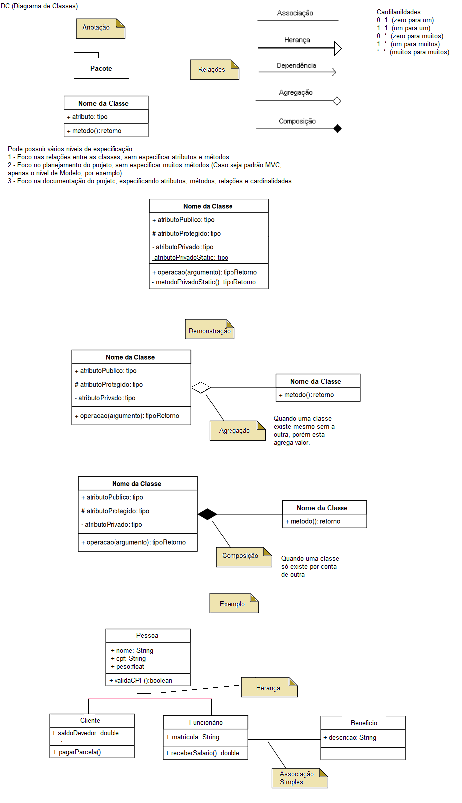
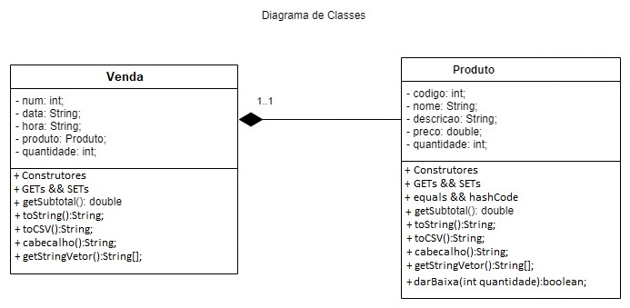

# Diagrama de Classes

## Diagramas
### Diagrama de Classes

Permite a visualização das classes utilizadas pelo sistema e como elas se relacionam.

Apresenta uma visão estática de como as classes estão organizadas a fim de definir sua estrutura lógica.

Foi projetado para ser uma evolução (e não substituição) do Modelo Entidade-Relacionamento do Banco de Dados.

