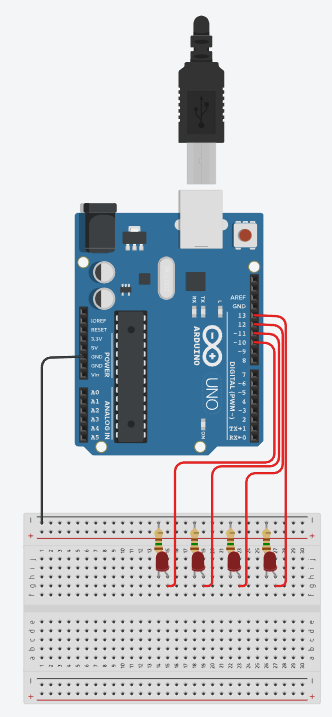
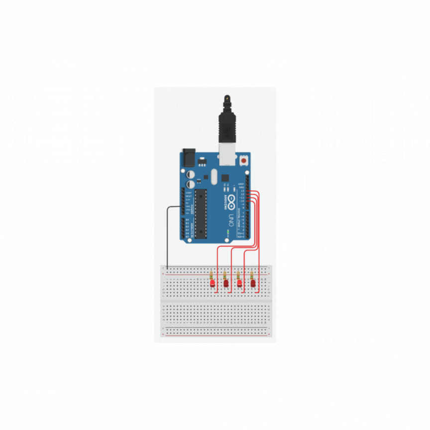
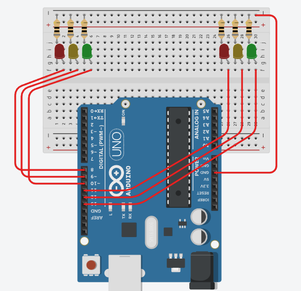

# Aula09 - Labs
Laboratórios simulados ou práticos
- Simulado - Utilizando simulador Packet Tracer ou - [TinkerCAD](https://www.tinkercad.com/)
- Prático - Utilizando kit IoT
## Componentes Eletrônicos Básicos

## [TinkerCad](https://www.tinkercad.com/)
TinkerCad simulador Web para projetos 3D, eletrônica e codificação.
## Conta
Inscreva-se, com uma conta **pessoal**

## Primeira simulação com Arduíno
Arduíno é uma placa com microcontrolador digital programável em linguagem C, possui vários pinos que podem ser programáveis onde conectamos sensores e atuadores

O circuito acima possui 4 leds, 4 resistores ligados as portas 10, 11, 12, 13 de um Arduino UNO, e conectados em uma **protoboard** e ligados no **GND** (terra) do Arduíno.<br>O código a seguir pisca as luzes alternadamente de duas em duas.
```c
void setup(){
	pinMode(10, OUTPUT);
	pinMode(11, OUTPUT);
	pinMode(12, OUTPUT);
	pinMode(13, OUTPUT);
}
void loop(){
	digitalWrite(10,1);
  	digitalWrite(11,0);
  	digitalWrite(12,1);
  	digitalWrite(13,0);
  	delay(500);
  	digitalWrite(10,0);
  	digitalWrite(11,1);
  	digitalWrite(12,0);
  	digitalWrite(13,1);
  	delay(500);
}
```
- Resultado<br>

## Desafio
|Contextualização|
|-|
|Sr. Adolfo é síndico de um condomínio muito grande, possui mais de 1500 casas com duas vagas na garagem cada uma. Nos horários de pico o cruzamento principal que leva a portaria fica congestionado, para resolver o problema precisa instalar um semáforo|


|Desafio|
|-|
|Construa dois semaforos controlados por um Arduíno UNO para o cruzamento da portaria, como protótipo, deixe a luz verde com 2,5 segundos, a amarela com 0,5 segundos e o vermelho com 3 segundos, garanta que não haja acidentes causados por má programação dos semáforos|

#### Protótipo
