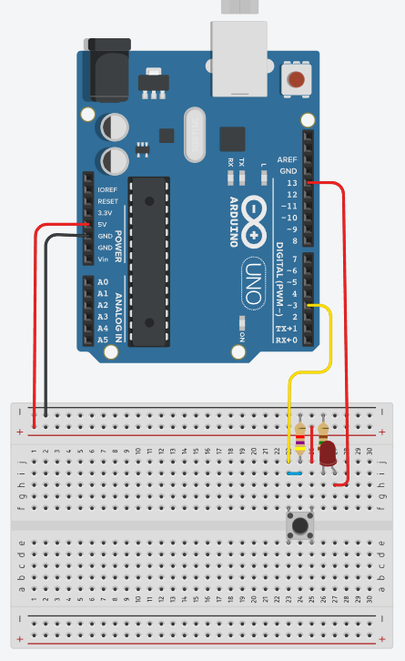
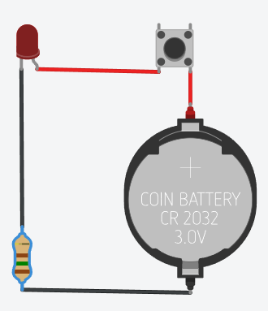
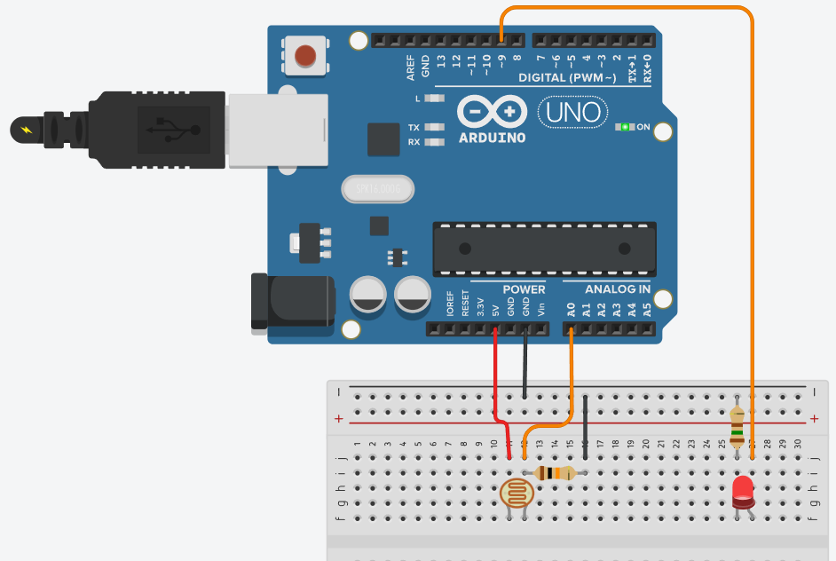
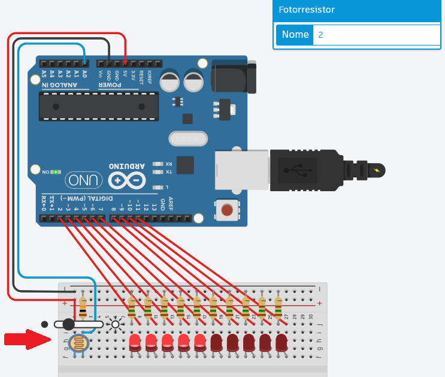

# Aula10
## [TinkerCad](https://www.tinkercad.com/) ou Prática com componentes reais

## Arduíno - Obtendo o click de um botão de comando
Para esta demosntração, vamos montar um circuito com um led e um botão, também precisaremos de dois resistores de 150 ohms para o led e de 4.7 khms para o botão.
<br>
O mesmo circuito pode ser montado sem a utilização do Arduino porém fica limitado apenas a pressionar o botão e segurar para acender o led
<br>
A programação a seguir acende o led ao clicar no botão, e se estiver aceso apaga o led ao clicar no botão, caso o botão seja mantido pressionado o led ficará piscando.
```c
/* 1 BOTAO LIGA DESLIGA LED */
int led = 13; // Variável led assume o valor do pino 3
int botao = 3; // variável recebe o valor proveniente do sensor
int status = 0; //Variável do status do led desligado
void setup(){ // Configurações - Pinos de Entrada/Saída
pinMode(led, OUTPUT); // Configura led(pino 13) como saída
pinMode(botao, INPUT); // Configura botao(pino 3) como entrada
} // Fim da configuração
void loop(){ // Início do Programa
	int click = digitalRead(botao);
	if (click == 1){ // Se pino 3 for igual a 1:
		if(!status){
			digitalWrite(led,1); // Aciona pino 13, NL=1 ou 5V na saída 13
			status = 1;
		} else { 
			digitalWrite(led,0); // Desliga a saída digital 13
			status = 0;
		}
		delay(500); // Tempo para remover flutuações ao clicar no botão
	}
} // Fim do Programa
```
A vantagem da utilização de um **microcontrolador** como o Arduino é justamente a programação e a interconectividade com a internet através de uma **shield wifi** ou ethernet.

## Arduíno - Acendendo um led com um sensor de luz
Esta demonstração replica o que acontece nos postes de nossas ruas todas as noites, acendem automaticamente ao anoitecer. Precisaremos de dois resistores, um de 10kohm para o sensor de luminosidade (Fotoresistor) e um de 150ohm para o led.
<br>
```c
int sensorLuminosidade = 0;
int led = 9;

void setup(){
	pinMode(led, OUTPUT);
}
void loop(){
	int nivelDeLuz = analogRead(sensorLuminosidade);
	nivelDeLuz = map(nivelDeLuz, 0, 900, 255, 0);
	nivelDeLuz = constrain(nivelDeLuz, 0, 255);
	analogWrite(led, nivelDeLuz);
}
```
O sensor de luminosidade, como a maioria dos sensores é analógico, significa que possui níveis de luminosidade, é um resistor que vai de 0 a 900 níveis diferentes, a porta número 9 configurada como saída também é analógica, fornecendo de 0 a 255 níveis de tenção, usamos a função map() para converter a escala de 0 a 900 para 0 a 255, desta forma quanto menos luz ambiente mais forte o led brilha.

|Desafio|
|-|
|Construa um circuito semelhante ao anterior com um Fotoresistor e 10 leds, ao simular o aumento da luminozidade os leds vão se apagando|
||
||