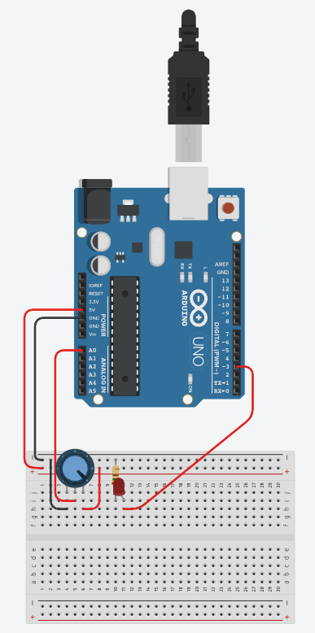
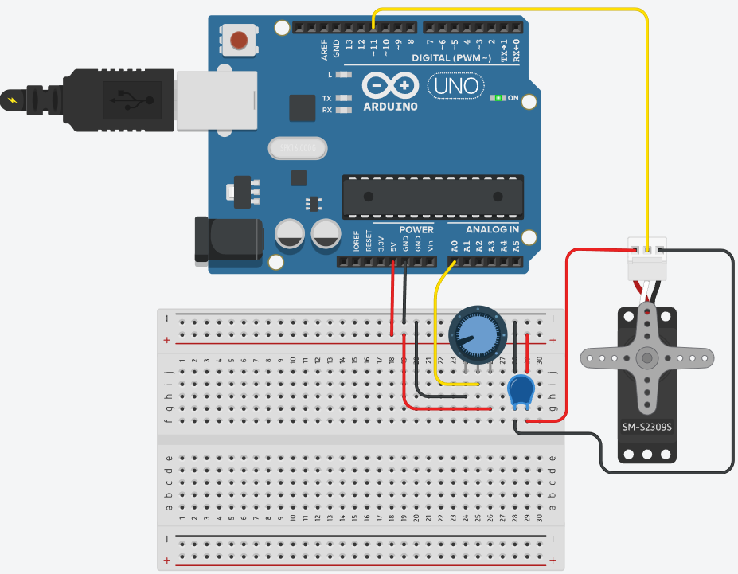
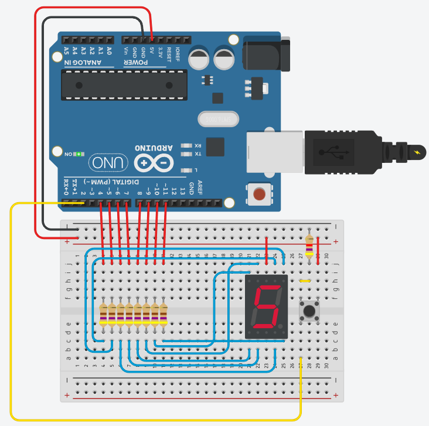

# Aula 11

## Prática com Arduino
### Potenciômetro
Potenciômetro é um tipo de resistor porém com um botão que aumenta e diminui a resistência, excelente para controlar o nível de sensibilidade de outros sensores, ou atuadores.
<br>A demonstração a seguir contêm um Arduino UNO, um potenciômetro de 150Kohms um led vermelho e um resistor de 150 ohms.
<br>
<br>O código a seguir dmonstra o controle da potência de um led controlada por um potenciometro, através da eletrônica digital com um processador Arduino.
```c
int led = 3; // Variável led assume o valor do pino 3
int potenc = 0; // variável recebe o valor proveniente do sensor
void setup(){ // Configurações - Pinos de Entrada/Saída
pinMode(led, OUTPUT); // Configura led(pino 3) como saída
} // Fim da configuração
void loop(){ // Início do Programa
 potenc = analogRead(0); // Variável potenci recebe o valor da entrada A0
if (potenc >512){ // Se pino 2 for igual a 1:
digitalWrite(led,1); // Aciona pino 13, NL=1 ou 5V na saída 3
} else { // Senão:
digitalWrite(led,0); // Desliga a saída digital 3
} // Fim do Senão
} // Fim do Programa
```

## Atividade
Controlando um servo motor (Micro Servo) ao girar um potenciômetro de 1Kohm, para isso será necessário utilizar um capacitor de 100 mF para completar o circuito com o Micro servo.
<br>
<br> **Desafio:** Codifique um programa para controlar o giro do Micro servo ao girar o potenciômetro.

### Visor de sete seguimentos
A seguir temos um Arduino UNO conectado a um display de 7 seguimentos para isso será necessário 8 resistores de 470ohms, um resistor de 4.7Kohms ligado ao Botão de comando.
<br>
<br>O código a seguir é um contador de 0 a 9 quando o botão é pressionado
```c
int a = 4, b = 5, c = 6, d = 7, e = 8, f = 9, g = 10;
int botao = 2;
int num = 0;
int entrada[7] = {a,b,c,d,e,f,g};
int display[10][7] = {{a,b,c,d,e,f},{b,c},{a,b,d,e,g},{a,b,c,d,g},{b,c,f,g},{a,c,d,f,g},{a,c,d,e,f,g},{a,b,c},{a,b,c,d,e,f,g},{a,b,c,f,g}};
void setup() {
	for(int i=0;i<7;i++) pinMode(entrada[i],OUTPUT);
	pinMode(botao,INPUT);
}
void loop() {
	int click = digitalRead(botao);
	delay(100); //Evitar flutuaçao no clique
	if(click) num++;
	if(num < 10) numero(num); else num = 0;
}
void numero(int coluna) {
	for(int i=0;i<7;i++) digitalWrite(entrada[i],1);
	for(int linha=0;linha<7;linha++){
		digitalWrite(display[coluna][linha],0);
	}
}
```
- **Desafio:** troque o botão por um potenciômetro de 1Kohm que quando girado aumente de 0 a 9 e mostre no display.