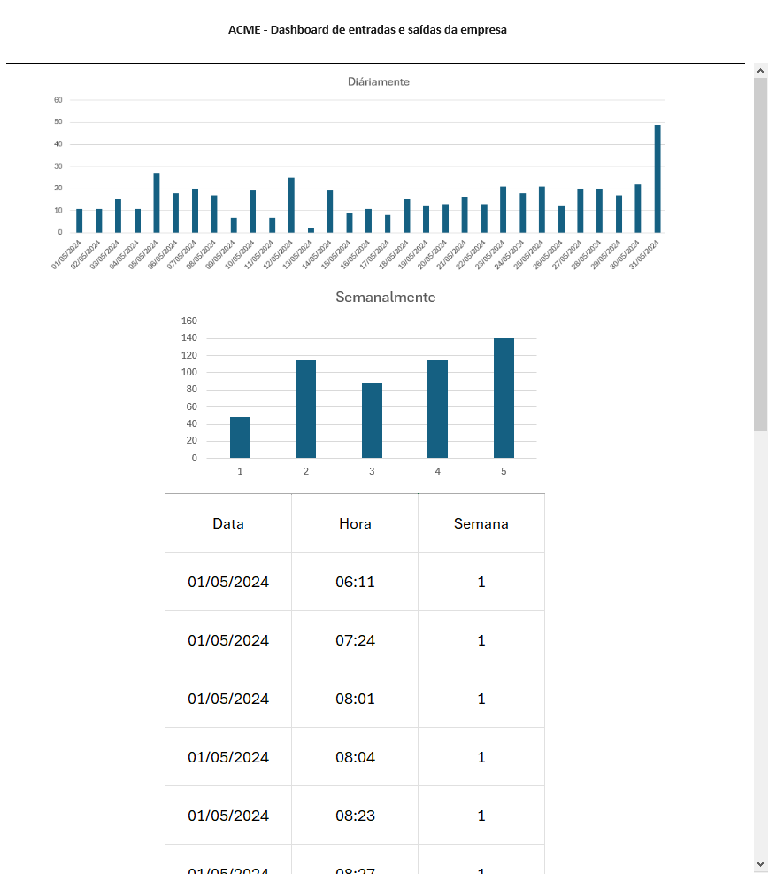

# Aula12
## Dashboard
A partir de dados obtidos com sensores, podemos montar um painel de controle para visulizar graficamente estes dados.
Para isso temos várias ferramentas, desde o Excel, PowerBI até uma Página HTML que pode mostrar os dados em tempo real além de emitir comandos através de formulários.

- Excel
- PowerBI
- Página Web

## Prática
A partir dos dados do arquivo **dados.csv** neste repositório monte uma pácina HTML ou um dashboard no Excel ou PowerBI semelhante ao do wireframe (esboço) a seguir:

