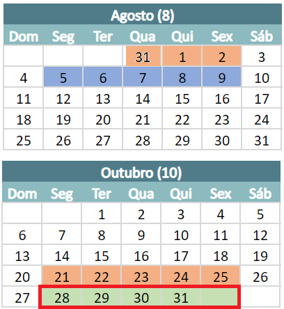

# Olimpíada do Conhecimento
## Modalidade 08 - Desenvolvimento de Aplicativos Moveis
- World Skills 2026
- São Paulo Skills 2024 (Documentos - Necessário estar logado com e-mail corporativo)
  - [Regulamento Geral e Descritivo técnico](./regulamento/)

## Githubs
- https://github.com/paulobrandaodev
- https://github.com/Seletiva-Nacional-2023
- https://github.com/World-Skills-Senai-134
- [Exemplo de Provas - João Pedro](https://github.com/Joaoopeedro/Modulos_WorkShop/tree/main)

|Provas|Provas|Peso|
|-|-|-|
|Design Figma|2 de 10|20|
|Funcionalidade - Consumo de APIs, JSON, Firebase|2 de 15|30|
|Desenvolvimento - Sensores, GPS, Localização, Câmera ...|2 de 15|30|
|Testes automatizados UI, UX|1 de 20|20|

## Exemplos de Prova e Simulados
- https://github.com/Seletiva-Nacional-2023/Simulados-05-09-2023
- https://github.com/Seletiva-Nacional-2023/Simulados-06-09-2023

## Ferramentas
- Design, Figma
- Testes automatizados, Maestro by mobile dev, Robotium, Apium
- JSON Server
- API Google Maps, Distancies, metrics

## Próximo Workshop
Próximo Workshop 31-07 01 e 02 - 08

## Calendário oficial

|Calendário|Legenda|
|-|-|
||**31 a 02 de Agosto**, WorkShop e Simulado **21 a 25 de Outubro**, WorkShop de alterações nas provas **28 a 31 de Outubro**, Estadual|

## Links úteis
- [Pequenos vídeos para auxiliar designs - Pexels](https://www.pexels.com/videos/)
- [Firebase - Base de dados](https://firebase.google.com/)
- [Lista de ícones 3D - Sketchfab](https://sketchfab.com/)
- [COmpartilhar print SNAG.GY](https://snipboard.io/)
- [COmpartilhar código Code Share](https://codeshare.io/)