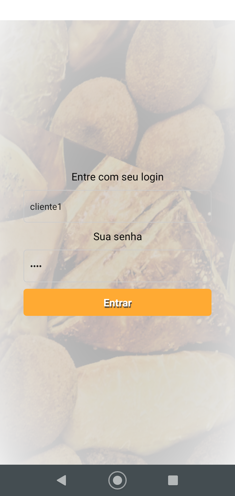
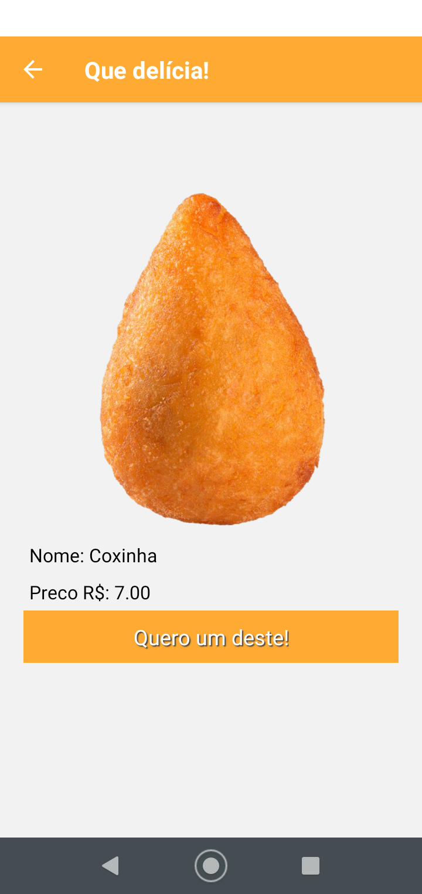
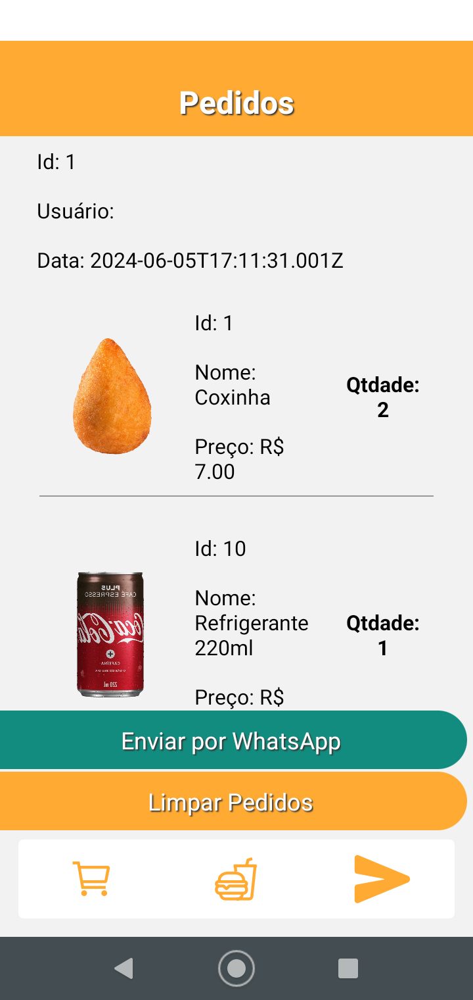

# Desafio - App Pedidos
- Mockups
- Carrinho de compras
- Botton Navigation

Desenvolver um app consumindo os mocks deste repositório seguindo os modelos dos screenshots abaixo:
<table>
    <tr>
        <td>
            
        </td>
        <td>
            
        </td>
        <td>
            
        </td>
    </tr>
    <tr>
        <td>
            Tela de Login
        </td>
        <td>
            Carrinho de Compras vazio
        </td>
        <td>
            Lista de Produtos
        </td>
    </tr>
    <tr>
        <td>
            
        </td>
        <td>
            
        </td>
        <td>
            
        </td>
    </tr>
    <tr>
        <td>
            Acompanhamento dos pedidos vazia
        </td>
        <td>
            Detalhes do produto e botão para adicionar ao carrinho
        </td>
        <td>
            Carrinho com o pedido Botão para concluir ou limpar
        </td>
    </tr>
    <tr>
        <td colspan="3" align="center">
            
             Tela de acompanhamento do pedido com um pedido de exemplo
             Botão para enviar por WhatsApp para cobrar urgência
        </td>
    </tr>
</table>