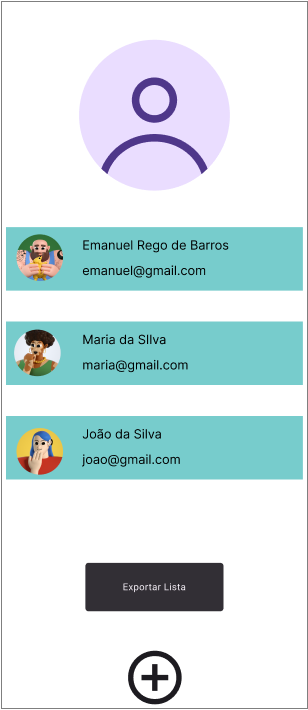

# Desafio XML
## Contextualização
A escola precisa de um App que manipule todos os alunos contidos na lista a seguir que está no formato XML, o aplicativo deve ler os dados do arquivo, permitir cadastrar um novo usuário e exportar para um novo arquivo XML.

- usuarios.xml
```xml
<usuarios>
    <usuario>
        <id>1</id>
        <nome>Emanuel Rego de Barros</nome>
        <email>emanual@gmail.com</email>
        <senha>123456</senha>
    </usuario>
    <usuario>
        <id>2</id>
        <nome>Maria da Silva</nome>
        <email>maria@gmail.com</email>
        <senha>123456</senha>
    </usuario>
    <usuario>
        <id>3</id>
        <nome>João da Silva</nome>
        <email>joao@gmail.com</email>
        <senha>123456</senha>
    </usuario>
</usuarios>
```

## Componentes visuais
- 1 Ícone representando usuário
- 2 Lista de usuários
- 3 Botão para "Exportar Lista" no formato XML
- 4 Botão "+" para acrescentar novo usuário na lista
