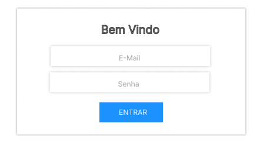

# Situação de Aprendizagem - Sistema de Turmas e Atividades

## Contextualização
Na educação a falta de organização relacionada às atividades desenvolvidas pelos professores durante as aulas pode ocasionar problemas de gestão dos conhecimentos já trabalhados e avaliados. É fundamental, para que se possa atingir os objetivos educacionais, que os professores tenham controle sobre as atividades que serão aplicadas às turmas.<br>Muitas escolas situadas em áreas remotas do Brasil não possuem um sistema para solucionar essa falta de organização, acarretando prejuízos aos estudantes, professores e ao processo educacional como um todo.

## Desafio
Você foi desafiado a desenvolver um sistema web ou desktop que permitirá ao professor se autenticar em um sistema para visualizar, registrar, excluir suas turmas, assim como registrar atividades para as suas turmas e sair do sistema.

## Resultados e entregas esperadas
|Nº|Nome da entrega|Tipo de entrega|Tempo<br>estimado<br>(minutos)|
|-|-|:-:|:-:|
|1|Protótipo Funcional Celular|Modelagem do sistema|40|
|2|Protótipo Funcional Tablet|Modelagem do banco de dados|40|
|3|Dados JSON Server|Desenvolvimento da API com arquivos JSON anexos|40|
|4|Tela de autenticação de usuários (login)|Desenvolvimento do sistema|20|
|5|Tela principal do professor|Desenvolvimento do sistema|15|
|6|Cadastro de turma|Desenvolvimento do sistema|15|
|7|Listar turmas do professor|Desenvolvimento do sistema|20|
|8|Exclusão de turma|Desenvolvimento do sistema|20|
|9|Tela de atividades da turma|Desenvolvimento do sistema|15|
|10|Listar atividades da turma|Desenvolvimento do sistema|15|
|11|Cadastro de atividade para a turma|Desenvolvimento do sistema|15|
|12|Sair do sistema (logout)|Desenvolvimento do sistema|05|
|13|Lista de requisitos de infraestrutura|Documentação do sistema|05|

### Obss:
- O sistema deverá ser desenvolvido na linguagem, framework e banco de dados de sua preferência.
- Não é necessário controle de autenticação JWT.

### 1. Protótipo Funcional Celular
Desenvolva utilizando Figma o protótipo funcional para celular e salve o arquivo em **./docs**.

### 2. Protótipo Funcional Tablet
Desenvolvimento da API com arquivos JSON anexos **./docs**.
-professores.json
```json
[
    {
        "id": 1,
        "nome": "Emanuel Rego de Barros",
        "email": "emanual@gmail.com",
        "senha": "123456"
    },
    {
        "id": 2,
        "nome": "Maria da Silva",
        "email": "maria@gmail.com",
        "senha": "123456"
    },
    {
        "id": 3,
        "nome": "João da Silva",
        "email": "joao@gmail.com",
        "senha": "123456"
    }
]
```
- turmas.json
```json
[
    {
        "id": 1,
        "nome": "1DES",
        "professorId": 1
    },
    {
        "id": 2,
        "nome": "2DES",
        "professorId": 1
    },
    {
        "id": 3,
        "nome": "3DES",
        "professorId": 1
    },
    {
        "id": 4,
        "nome": "1EA",
        "professorId": 2
    },
    {
        "id": 5,
        "nome": "2EA",
        "professorId": 2
    },
    {
        "id": 6,
        "nome": "3EA",
        "professorId": 2
    },
    {
        "id": 7,
        "nome": "1MECB",
        "professorId": 3
    },
    {
        "id": 8,
        "nome": "2MECB",
        "professorId": 3
    },
    {
        "id": 9,
        "nome": "3MECB",
        "professorId": 3
    }
]
```
- tividades.json
```json
[
    {
        "descricao": "Atividade 1 Fluxograma do processo de diferenciar triângulos",
        "turmaId": 1
    },
    {
        "descricao": "Atividade 2 Imterface HTML de um currículo",
        "turmaId": 1
    },
    {
        "descricao": "Atividade 3 Estiliização CSS de um currículo",
        "turmaId": 1
    },
    {
        "descricao": "Atividade 1 Código de um jogo de adivinhação",
        "turmaId": 2
    },
    {
        "descricao": "Atividade 1 DER do Banco de dados de uma locadora de filmes",
        "turmaId": 2
    },
    {
        "descricao": "Atividade 1 Análse de risco com matriz SWOT",
        "turmaId": 3
    },
    {
        "descricao": "Atividade 2 Códificar um programa de Ordens de Servoço",
        "turmaId": 3
    },
    {
        "descricao": "Atividade 1 Identificar componentes eletrônicos",
        "turmaId": 4
    },
    {
        "descricao": "Atividade 2 Tipos de Correntes elétricas",
        "turmaId": 4
    },
    {
        "descricao": "Atividade 1 Algoritmo de ordenação de vetores",
        "turmaId": 5
    },
    {
        "descricao": "Atividade 2 Protótipos com a Protoboard",
        "turmaId": 5
    },
    {
        "descricao": "Atividade 1 Simulação com o software Proteus",
        "turmaId": 6
    },
    {
        "descricao": "Atividade 2 Protótipo com Thinkercad",
        "turmaId": 6
    },
    {
        "descricao": "Atividade 1 Tipos de materiáis metálicos",
        "turmaId": 7
    },
    {
        "descricao": "Atividade 2 Cálculos de resistência de materiais",
        "turmaId": 7
    },
    {
        "descricao": "Atividade 1 Lubricantes e suas aplicações",
        "turmaId": 8
    },
    {
        "descricao": "Atividade 2 Manutenção de motores elétricos",
        "turmaId": 8
    },
    {
        "descricao": "Atividade 1 Relatório de ensaio de tração",
        "turmaId": 9
    },
    {
        "descricao": "Atividade 2 Relatório de ensaio de compressão",
        "turmaId": 9
    },
    {
        "descricao": "Atividade 3 Interpretação de gráficos de ensaios",
        "turmaId": 9
    }
]
```

### 3. Dados JSON Server
Você deverá desenvolver o script de criação do banco de dados contendo a criação do banco de dados **“turmas_db”** e das tabelas de acordo com o diagrama entidade e relacionamento desenvolvido na entrega 2. No script deverão existir pelo menos **três registros** para todas as tabelas criadas, respeitando os tipos de dados, chaves primárias e estrangeiras.
O script do banco de dados deverá ser entregue no formato .sql e salvo na pasta **./docs**.

### 4. Tela de autenticação de usuários (login)
Você deverá desenvolver uma tela de autenticação de usuários contendo um campo para informar o e-mail, um campo para informar a senha e um botão “entrar”. Essa deverá ser a tela principal que o usuário verá ao acessar o sistema.<br>O botão “entrar” deverá dar acesso a “tela principal do professor” caso o e-mail e senha informados sejam autenticados no banco de dados, criando então uma sessão. Caso o e-mail e senha não sejam autenticados, o usuário deverá ser redirecionado novamente à tela de autenticação. A imagem a seguir demonstra um exemplo do que deve ser desenvolvido nessa tela. O design do layout é de sua escolha, porém, deverá contemplar os elementos solicitados.
- 

### 5. Tela principal do professor
Você deverá desenvolver a tela principal do professor contendo os itens:
- Exibição do nome do professor autenticado no sistema
- Botão para sair do sistema
- Um botão para acesso ao “cadastro de turma”
- Listagem de turmas, contendo, os dados estáticos:
    - Número da turma
    - Nome da turma
    - Botão para excluir
    - Botão para visualizar
- A imagem (wireframe) a seguir representa um exemplo do que deve ser desenvolvido nessa tela. O design do layout é de sua escolha, porém, deverá contemplar os elementos solicitados.
- 

### 6. Cadastro de turma
Você deverá desenvolver uma tela contendo um campo, onde o usuário irá informar o nome da turma e um botão “cadastrar”. No banco de dados, deve ser registrada uma nova turma considerando o nome informado e o professor que cadastrou a turma. Uma turma pertence somente a um professor, porém, o
professor pode ter várias turmas.

### 7. Listar turmas do professor
Na tela principal do professor você deverá listar as turmas registradas no banco de dados que sejam pertencentes ao professor autenticado no sistema. A partir de cada turma listada, deve ser possível acessar a “exclusão de turmas” (botão excluir) e a “tela de atividades da turma” (botão visualizar).

### 8. Exclusão da turma
Na listagem das turmas na tela principal do professor você deverá adicionar ao botão “excluir” a funcionalidade de exclusão do banco de dados da turma selecionada.<br>Antes de excluir a turma do banco de dados, deverá ser apresentada uma tela de confirmação ao usuário, questionando se ele realmente quer excluir a turma.<br>Caso uma turma tenha atividades cadastradas para ela, essa turma não poderá ser excluída do banco de dados e a mensagem “Você não pode excluir uma turma com atividades cadastradas” deverá ser mostrada ao usuário e a ação não executada.

### 9. Tela de atividades da turma
Você deverá desenvolver a tela de atividades da turma contendo:
- Exibição do nome do professor autenticado no sistema
- Botão para sair do sistema
- Um botão para acesso ao “cadastrar atividade”
- Listagem de atividades, contendo os dados estáticos:
    - Número da atividade
    - Descrição da atividade
- A imagem (wireframe) a seguir representa um exemplo do que deve ser desenvolvido nessa tela. O design do layout é de sua escolha, porém, deverá contemplar os elementos solicitados.
- 
- Os dados apresentados podem ser estáticos, nesse momento, pois na entrega **10 listar atividades da turma**, será solicitada a listagem dinâmica de acordo com o banco de dados.

### 10. Listar atividades da turma
Na “tela de atividades da turma” você deverá listar as atividades registradas no banco de dados pelo professor da turma selecionada, mostrando o número da atividade e a descrição da atividade. Além disso, exibir o nome da turma.

### 11. Cadastro de atividade para a turma
Você deverá criar uma tela para o cadastro das atividades da turma, contendo um campo onde o usuário deverá informar a descrição da atividade. No banco de dados deverá ser registrada uma nova atividade considerando a descrição informada e a turma selecionada. Uma atividade pertence somente a uma turma, porém, a turma pode ter várias atividades.

### 12. Sair do sistema (logout)
Você deverá efetuar o logout do usuário que está autenticado, assim que ele clicar no botão **“sair”**, destruindo a sessão e redirecionando-o para a tela de autenticação de usuário (login).

### 13. Lista de requisitos de infraestrutura (README)
Você deverá desenvolver uma lista de requisitos de infraestrutura para a instalação do sistema desenvolvido, nessa lista deverá conter os seguintes itens:
- Protótipos FIGMA
- Quais a linguages e versão são utilizadas no sistema desenvolvido. (Dart Flutter)
- A lista de requisitos deverá ser escrita no arquivo README.md do projeto, utilizando a lnguagem Markdown.
- Tutorial de como testar o aplicativo

## Entregas:
Você deverá efetuar as entregas nos seguinte formato:
- Um repositório público no GitHub chamado "escola_aula07", contendo:
    - Pasta **./docs** com os arquivos das entregas 1 e 2.
    - Pasta **./api** com os arquivos do back-end (JSON Server) entrega 3
    - Pasta **./app** com os arquivos das entregas 4, 5, 6, 7, 8, 9, 10, 11 e 12.
    - Arquivo README.md com a lista de requisitos de infraestrutura (entrega 13).