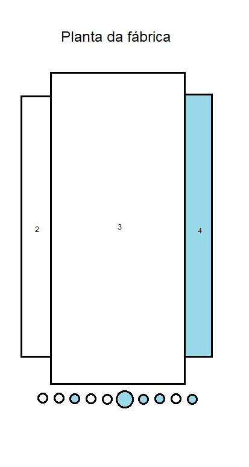

# Situação de Aprendizagem - Fábrica de automóveis

## Contextualização
O mercado automotivo está em constante mudança e as fábricas que conseguem dinamizar seu processo logístico tendem a alcançar uma vantagem competitiva em relação às outras e, consequentemente, conseguem produzir mais automóveis realizando mais vendas.

## Desafio
Para ajudar a solucionar esse problema, você deverá criar um sistema mobile ou tablet do pátio de automóveis de uma fábrica, onde os funcionários poderão clicar em uma área e visualizar os automóveis que estão atualmente alocados para ela. Também deve ser possível, através desse sistema, vender automóveis de uma área qualquer do pátio.  Abaixo você verá detalhadamente as entregas que deverão ser efetuadas e quais requisitos elas deverão cumprir.

## Entregas
Ao final desse projeto você terá que entregar:
### Prova de Design Celular
|Nº|Nome da Entrega|Descrição|Tempo minutos|
|:-:|-|-|:-:|
|1|Identidade Visual|Crie uma Paleta de cores, Escolha uma fonte, crie um logotipo e uma logomarca|30|
|2|Protótipo funcional para celular|Que represente o cenário proposto acima, com um carrocel representando as áreas da planta da fábrica e permitindo a venda de automóveis|150|
|3|Splash Screen|Uma animação de entrada com o logotipo ou logomarca com efeito de **aparecer**||
|4|Tela inicial pátio de automóveis|Um carrocel com as 10 areas, onde as que possuem automóveis tenham uma cor diferente das que não possuem||
|5|Tela com detalhes de uma área|Ao clicar em uma área do carrocel que possua automoveis deve apresentar uma lista e um botão para inserir itens/automoveis||
|6|Tela de venda de automóvel|Ao clicar em um automóvel deve ser direcionado a um modal que permita vendê-lo escolhendo o cliente e a concessionária||
|7|Aviso de confirmação de venda|Ao concluir a venda deve apresentar uma mensagem de confirmação através de uma janela/modal||
|8|Avisos e alertas de erro|Mensagem de alerta de pouca bateria e de sem conexão com a internet devem ser representadas no protótipo||

### Prova de Design Tablet
|Nº|Nome da Entrega|Descrição|Tempo minutos|
|:-:|-|-|:-:|
|1|Protótipo funcional para tablet aproveitando a identidade visual criada na prova anterior|Que represente o cenário proposto acima com a planta da fábrica o mais semelhate possíval ao wireframe proposto a frente.|150|
|2|Splash Screen|Uma animação de entrada com o logotipo ou logomarca com efeito **girar** o logo||
|3|Tela inicial pátio de automóveis|Criação de uma tela que apresentará a planta do pátio de automóveis com suas respectivas áreas semelhante ao wireframe a seguir||
|4|Tela com detalhes de uma área|Criação de uma tela que permita ao usuário visualizar os automóveis alocados para uma determinada área, utilizando cards para cada automóvel||
|5|Tela de venda de automóvel|Criação de uma tela que permita ao usuário vender um automóvel de uma área escolhendo o cliente e a concessionária.||
|6|Aviso de confirmação de venda|Ao concluir a venda deve apresentar uma mensagem de confirmação através de uma janela/modal||
|7|Avisos e alertas de erro|Mensagem de alerta de pouca bateria e de sem conexão com a internet devem ser representadas no protótipo||

### Prova de Desenvlvimento Celular
|Nº|Nome da Entrega|Descrição|Tempo minutos|
|:-:|-|-|:-:|
|1|Splash Screen|Uma animação de entrada com o logotipo ou logomarca conforme foi definido no protótipo funcional||
|2|Tela inicial do pátio de automóveis|Com um carrocel representando as áreas da planta da fábrica ao escolher uma opção direcionar para a tela de detálhes da área||
|3|Tela com detalhes de uma área|Criação de uma tela que permita ao usuário visualizar os automóveis alocados para uma determinada área em uma lista com a quantidade de automóveis destacada||
|4|Tela de venda de automóvel|Ao escolher um automóvel da lista direcionar para uma tela que permita ao usuário vender um automóvel de uma área escolhendo o cliente e a concessionária e confirmando a venda através de um botão.||
|5|Aviso de confirmação de venda|Ao concluir a venda deve apresentar uma mensagem de confirmação através de uma janela/modal||
|6|Avisos e alertas de erro|Mensagem de alerta de pouca bateria e de sem conexão com a internet devem ser representadas no protótipo||

### 1. Identidade Visual
- No desenvolvimento dessa prova você deve considerar os seguintes padrões:
- Para todos os textos a fonte que você deverá utilizar é **Segoe UI**.
- A sugestão de cores que podem ser utilizadas no desenvolvimento das suas telas são:

|RGB|HEXADECIMAL|
|-|-|
|255, 255, 255|#FFFFFF|
|120, 20, 255|#7814FF||
|112, 112, 112|#707070|
|0, 0, 0|#000000|

- Porém se preferir pode utilizar outra paleta e fonte.

### 2. Splash Screen
Uma animação de entrada com o logotipo ou logomarca com efeito de **aparecer** para celular e girar para tablet no protótipo, já no desenvolvimento pode adicionar um terceiro efeito a sua escolha.

### 3. Tela inicial do pátio de automóveis
Criação de uma tela que apresentará a planta do pátio de automóveis com suas respectivas áreas para a prova de design para tablet, já para o design e programação para celular utilizar um carrocel conforme wireframes a seguir:
- Wireframe do carrocel para o celular
  
- Wireframe da planta da fábrica para tablet para o celular
  
Atente que essas imagens são representações do layout entregues nos arquivos "carrocel.png e planta.png". Você deve reproduzir na sua aplicação as posições e numerações das áreas indicadas nesse arquivo. As seguintes regras de negócio devem ser implementadas nessa tela: 
- 1 Cada região da planta sendo visualizada pelo usuário deve apresentar, além do número que representa a região, uma cor que indique a ocupação que aquela região possui.
    - 1.1 Branco (#FFFFFF): indica que aquela área está sem automóveis alocados para ela, ou seja, está com 0 ocupação (vazia).
    - 1.2 Colorido ex: Azul (#0000FF): indica que aquela área está com automóveis alocados para ela, ou seja, está com ocupação diferente de 0.

### 4. Tela com detalhes de uma área
Sempre que o usuário clicar em uma área que possua automóveis, então deve ser exibido para ele uma tela com as informações dos automóveis que se encontram naquela área. A imagem a seguir ilustra um exemplo de como essa tela poderia ser implementada:  
Atente que essa imagem é apenas um exemplo, sinta-se livre para criar seu próprio layout contanto que as seguintes regras de negócio estejam presentes:
- 1 Essa tela deve apresentar como título a identificação da área que está sendo visualizada pelo usuário. No exemplo da imagem acima, o título é “Área 10” porque essa é a área que está com seus detalhes sendo visualizados pelo usuário.
- 2 Essa tela deve exibir os dados dos automóveis que se encontram na área que foi clicada pelo usuário. Para cada automóvel listado, os dados devem ser:
    - Modelo do automóvel.
    - Preço do automóvel.
- 3 Cada automóvel listado deve possuir um botão “Vender” (ou recurso semelhante) associado a ele que ao ser clicado direcionará o usuário para a tela de venda de automóvel, descrita na próxima seção.
- 4 Caso a quantidade de um automóvel para essa área seja igual a 0 na base de dados, então esse automóvel não deverá ser exibido na listagem dessa tela.
- 5 Essa tela só aparece quando o usuário clica em uma área que possui automóveis, então se o usuário clicar em uma área que não contém automóveis uma mensagem deve ser exibida informando que a área clicada está vazia e a tela com detalhes de uma área não deve ser exibida.

### 5. Tela de venda de automóvel
Caso o usuário clique no botão “Vender” (ou recurso semelhante implementado por você) de algum automóvel exibido na tela com detalhes de uma área, então deve ser exibido para ele uma tela que permita que seja realizada a venda do automóvel. 
A imagem a seguir ilustra um exemplo de como essa tela poderia ser implementado:
  
Atente que essa imagem é apenas um exemplo, sinta-se livre para criar seu próprio layout contanto que as seguintes regras de negócio estejam presentes:
- 1 Essa tela deve apresentar como título o modelo do automóvel que está sendo vendido.
- 2 Essa tela deve possuir os campos:
    - 2.1 Cliente: esse select deve listar o nome de todos os clientes presentes na base de dados.
    - 2.2 Concessionária: esse select deve listar somente as concessionárias que possuem o automóvel que está sendo vendido na área que o usuário clicou previamente. Por exemplo, se as concessionárias A, B e C possuem o modelo XYZ na área 10, então essas 3 áreas aparecerão no select para escolha.
- 3 O botão “Confirmar” só deve ficar habilitado quando todos os campos forem preenchidos pelo usuário.
- 3.1 Quando o usuário clicar nesse botão, então a venda do automóvel deve ser efetuada e as informações de estoque do automóvel deve ser atualizada no banco de dados decrementando em 1 o valor previamente existente.

## Formato de entrega
O projeto deve ser entregue em um repositorio público git com o nome que preferir ex: "fabricaautos, automoveis...", com a seguinte estrutura de pastas:
- ./design_celular: contendo o arquivo do figma.
- ./design_tablet: contendo o arquivo do figma.
- ./app: contendo o código fonte do projeto.
- Um arquivo README.md contendo as tecnologias utilizadas no projeto e instruções de como executar o projeto.
O link do repositório deve ser enviado para este **[FORM - PROJETO - FABICA - AUTOMÓVEIS](https://forms.gle/RzjqXzqZ3STjGv5K6).**

## Orientações Gerais
**Atenção**: No diretório "media-files" você encontrará o arquivo **dados.json** que contem os dados para a criação da API com JSON server. Para instalar o JSON server utilize o comando `npm install -g json-server` e para rodar o servidor utilize o comando `json-server --watch dados.json`. O arquivo **dados.json** contém as informações dos automóveis, clientes e concessionárias que devem ser utilizadas no desenvolvimento do projeto.
se de dados que você precisará construir.

## [Avaliação](./avaliacao.md)